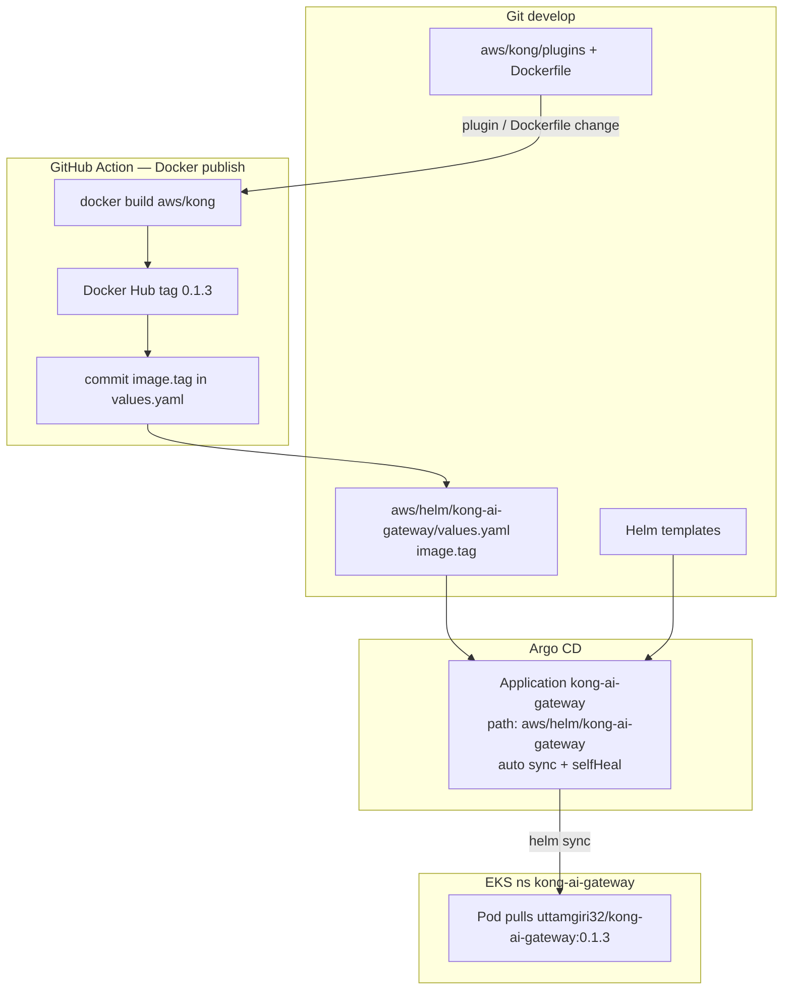

# Argo CD GitOps — Kong AI Gateway image

Argo CD already watches this repo and deploys the Helm chart. The **pod image** is whatever `values.yaml` names. Argo does **not** build Docker images and does **not** read `handler.lua`.

**Application:** `aws/argocd/kong-ai-gateway.yaml` (apply with `./aws/argocd/install.sh`)  
**UI:** http://ad03799c62bed4c97bb86fa9e9620e21-4fe42c6b263ea65a.elb.us-east-2.amazonaws.com:8080  
**App name:** `kong-ai-gateway` → namespace `kong-ai-gateway`

```yaml
# aws/helm/kong-ai-gateway/values.yaml  — this is what Argo deploys
image:
  repository: docker.io/uttamgiri32/kong-ai-gateway
  tag: "0.1.2"
```



---

## What Argo can see vs what it cannot

| You change | Git path | Argo sees it? | Cluster updates? |
| --- | --- | --- | --- |
| Helm `image.tag` | `values.yaml` | **Yes** | **Yes** — new pod, pulls that tag |
| Replicas, Istio, resources | Helm chart | **Yes** | **Yes** |
| Plugin Lua / `kong.yml` / Dockerfile | `aws/kong/` | **No** (not in the Application path) | **Not until** a new image exists **and** `image.tag` moves |

The plugin is **copied into the image at `docker build`**. Changing Lua in git without a new Hub tag leaves the running pod on the old image (`pullPolicy: IfNotPresent`).

---

## 1. Helm tag change (Argo only)

Edit `aws/helm/kong-ai-gateway/values.yaml`:

```yaml
image:
  tag: "0.1.3"
```

Push to **`develop`**. Argo polls git (about every 3 minutes), sees the tag, rolls the Deployment. The tag **must already exist** on Docker Hub or the pod goes `ImagePullBackOff`.

This is already on: `syncPolicy.automated` + `selfHeal: true`.

---

## 2. Plugin or Dockerfile change (Action then Argo)

1. Change `aws/kong/plugins/custom-header/`, `kong.yml`, or `Dockerfile`
2. Push to **`develop`**
3. Run **Actions → Docker publish Kong AI Gateway** (or let the `aws/kong/**` push trigger run it)
4. The job: builds, pushes Hub, **bumps patch** (`0.1.2` → `0.1.3`), commits `values.yaml`
5. Argo sees the new `image.tag` and redeploys

Do **not** only change the plugin and wait on Argo. Argo never opens the Lua files.

---

## Register the Application (once)

Namespaces + Argo CD + an image on Hub first.

```bash
./aws/argocd/install.sh
kubectl get application -n argocd kong-ai-gateway
```

Repo is public; Argo clones without a git secret.

---

## Check that it worked

```bash
kubectl -n argocd get application kong-ai-gateway
# SYNCED / HEALTHY

kubectl -n kong-ai-gateway get deploy kong-ai-gateway -o jsonpath='{.spec.template.spec.containers[0].image}{"\n"}'
# docker.io/uttamgiri32/kong-ai-gateway:<tag from values.yaml>
```

UI: app `kong-ai-gateway` → **App Diff** empty after sync. **Desired Manifest** shows `image: ...:0.1.x`.

---

## What not to expect

- Argo Image Updater is **not** installed. Tags are pinned in git on purpose (the Docker Action writes them).
- A git push of Helm templates without a tag change still syncs (config only), same image.
- Destroying Istio/NLB does not undeploy Kong; it only removes the public URL.
