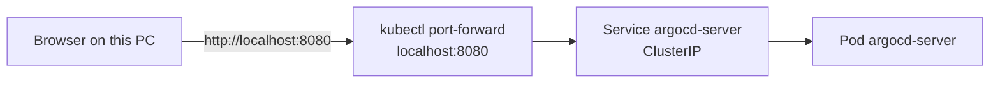

# Access Argo CD (namespace `argocd`)

Cluster: **`kong-ai-dev`** · Region: **`us-east-2`**  
Helm release: **`argocd`** (chart `argo/argo-cd` 10.1.4) · Service type: **ClusterIP** (no load balancer, no public URL)

There is **no** `https://something.amazonaws.com` dashboard. The UI is only on this PC while port-forward is running.



---

## What was created in `argocd`

The **namespace** was created earlier by `./aws/helm/namespace/install.sh`. This chart did **not** create the namespace.

**Running pods** (on the existing t3.medium — no extra EC2):

| Pod | Role |
| --- | --- |
| `argocd-server` | UI + API |
| `argocd-application-controller-0` | Syncs Applications to the cluster |
| `argocd-repo-server` | git clone / helm template |
| `argocd-redis` | Cache (required) |
| `argocd-applicationset-controller` | ApplicationSet controller (chart still deploys it) |

A Job `argocd-redis-secret-init` runs once and **Completes** (not a standing pod).

**Services** (all ClusterIP, no `EXTERNAL-IP`):

| Service | Ports |
| --- | --- |
| `argocd-server` | 80, 443 — this is the dashboard |
| `argocd-repo-server` | 8081 |
| `argocd-redis` | 6379 |
| `argocd-applicationset-controller` | 7000 |

Also: ConfigMaps (`argocd-cm`, `argocd-rbac-cm`, …), Secrets (`argocd-initial-admin-secret`, `argocd-secret`, redis), CRDs (Application, AppProject, …), ClusterRoles.

**Not created:** Dex, notifications, Ingress, LoadBalancer/NLB, Istio Gateway.

```bash
kubectl get pods,svc -n argocd
```

AWS console: **EKS → kong-ai-dev → Resources** can list these if your IAM user has cluster access. EC2 only shows the worker VM. There is no Argo CD URL in the AWS console.

---

## How to port-forward

kubectl must already use the EKS context (`aws eks update-kubeconfig --name kong-ai-dev --region us-east-2`). See [../namespace/CONNECT.md](../namespace/CONNECT.md).

```bash
kubectl -n argocd port-forward svc/argocd-server 8080:80
```

Leave that terminal open. Local port **8080** is forwarded to the Service’s port **80** (`server.insecure: true` in `values.yaml`).

Stop: `Ctrl+C` in that terminal.

If port 8080 is busy:

```bash
kubectl -n argocd port-forward svc/argocd-server 8081:80
# then open http://localhost:8081
```

---

## How to open the dashboard

1. Start port-forward (above).
2. Browser: **http://localhost:8080** (use `http://`, not `https://`).
3. Login:

| | |
| --- | --- |
| Username | `admin` |
| Password | `T5Oii87YHpy9MAPJ` |

This is the initial password from Secret `argocd-initial-admin-secret`. If you reinstall Argo CD, Helm generates a new one; print it with:

```bash
kubectl -n argocd get secret argocd-initial-admin-secret -o jsonpath='{.data.password}' | base64 -d
echo
```

**Re-install / print password again:**

```bash
./aws/helm/argocd/install.sh
```

---

## If the page does not load

- Confirm pods are Ready: `kubectl get pods -n argocd`
- Confirm port-forward is still running
- Confirm context: `kubectl config current-context` should contain `kong-ai-dev`
- Do not look for a public ALB/NLB — there is none on purpose (cost)
