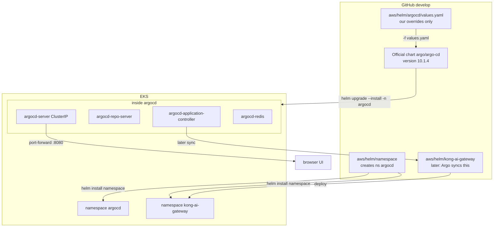
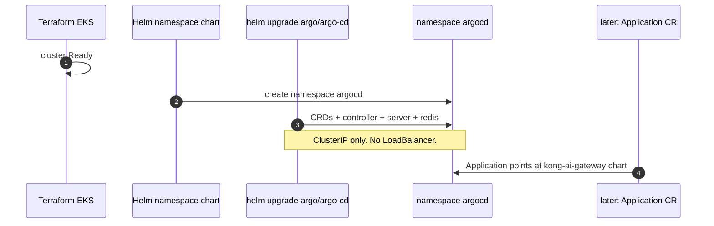
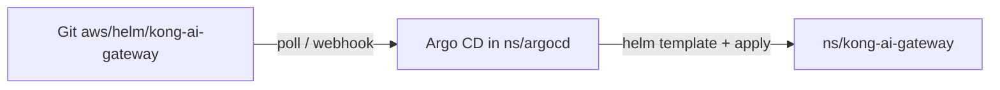

# Argo CD Helm install

Installs **Argo CD into namespace `argocd`**. That namespace is created by `aws/helm/namespace`, not by this chart.

## Helm, not raw `install.yaml`

Use the **official Helm chart**. Do not `kubectl apply` `manifests/install.yaml`.

| | Helm (`values.yaml`) | Raw manifests |
| --- | --- | --- |
| First install | `helm upgrade --install` | giant YAML blob |
| Change replicas, ingress, SSO later | edit **this** `values.yaml`, helm upgrade | edit generated YAML by hand |
| Chart upgrades | bump `--version` | re-copy upstream YAML |
| GitOps | Argo CD can render this same chart | hard to diff |

Yes: you can customize later. This file is only the deltas. Upstream defaults stay in the chart. Add ingress, HA, or SSO keys here when you need them — no rewrite of the install.

Do **not** put `kind: Namespace` here. Keep namespaces in `aws/helm/namespace`.

Dashboard, port-forward, and what lives in the namespace: **[ACCESS.md](ACCESS.md)**.

**AWS cost of this install: $0 extra** for a second balancer. The UI shares the existing Istio NLB on **:8080**.

Minimal pods in `argocd` (4):

| Keep | Why |
| --- | --- |
| server, controller, repo-server | Argo CD itself |
| redis (1) | **Required.** Sync will fail without it. Not ElastiCache (that would bill). |

| Off | Why |
| --- | --- |
| Dex | SSO only. Admin + port-forward does not need it |
| ApplicationSet | Only if you generate many Apps |
| notifications | Slack/email |
| redis-ha | Would add ~3 Redis pods |

---

## What runs where



Install order:



Data flow after Argo CD is up (Kong chart is a later step):



---

## Install (after EKS is Ready)

AWS login is **not** enough. Point kubectl at the cluster, create namespaces, then Argo CD:

```bash
aws eks update-kubeconfig --name kong-ai-dev --region us-east-2
kubectl get ns

./aws/helm/namespace/install.sh
./aws/helm/argocd/install.sh
```

`install.sh` here does **not** create namespaces. It checks that **`argocd` exists**, then `helm upgrade --install ... --namespace argocd`. That flag is how Helm puts Argo CD pods in `argocd`.

Argo CD namespace: **`argocd`**. Pods, Services, and the admin secret all live there (`kubectl -n argocd ...`).

`--namespace argocd` on step 2 must already exist (step 1). Do not pass `--create-namespace` on step 2 so the namespace chart stays the source of truth.

UI (no public load balancer):

```bash
kubectl -n argocd get secret argocd-initial-admin-secret -o jsonpath='{.data.password}' | base64 -d
echo
kubectl -n argocd port-forward svc/argocd-server 8080:80
# https://localhost:8080  user: admin
```

---

## Customize later

Edit `values.yaml`, then the same `helm upgrade --install` command. Examples you can add when needed:

```yaml
server:
  replicas: 2
  ingress:
    enabled: true
```

```yaml
redis-ha:
  enabled: true
```

Do not enable `server.service.type: LoadBalancer` until you accept the NLB + public IPv4 charge.

---

## Uninstall

```bash
helm uninstall argocd --namespace argocd
# CRDs stay unless you delete them on purpose
```

Namespace `argocd` stays until you uninstall `platform-namespaces`.
