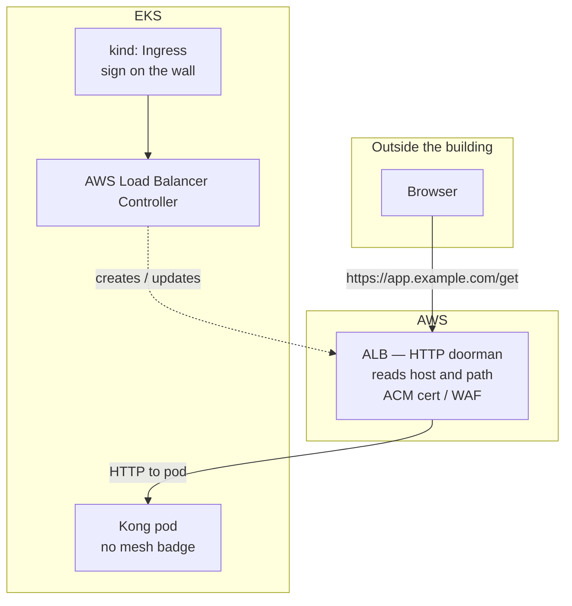
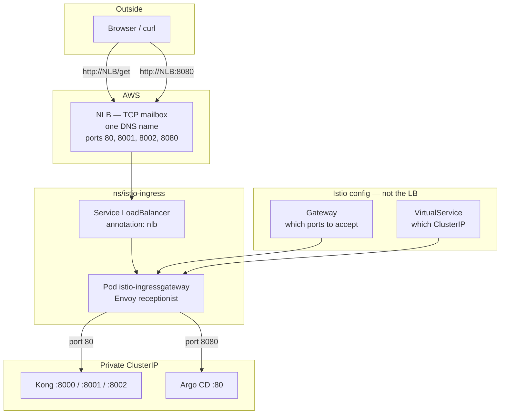
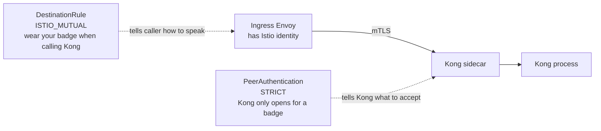

# Ingress + ALB vs Istio Gateway + NLB

This cluster uses **Istio Gateway + one internet NLB**. It does **not** use Kubernetes `Ingress` and does **not** use an ALB.

Default EKS: **no Ingress, no NLB, no ALB.** Apps are ClusterIP until you add a door.

---

## Layman: what you get from each

Think of the cluster as a **building**. Pods are **rooms**. The internet is **outside**.

### Ingress + ALB — hotel lobby board

AWS stands in the lobby, reads the **URL** (which hotel, which hallway), and walks you to the room.

| You get | In plain words |
| --- | --- |
| ALB | AWS’s HTTP doorman. Understands websites. Happy with HTTPS certificates (ACM) and WAF. |
| Ingress | A sign on the wall: “`/app` → that room.” The AWS Load Balancer Controller keeps the sign in sync. |
| Benefit | **Simple.** Few extra pods. AWS owns TLS. Good for “just put this website on the internet.” |
| You do not get | Locks **between rooms**. Extra TCP ports (8002, 8080) are clumsy. No mesh. |

### Istio Gateway + NLB — mailbox + receptionist (this repo)

AWS only provides a **mailbox** (NLB): dump any TCP packet here. Inside, a **receptionist** (Istio Envoy) sorts by **port**: 80 Kong, 8002 Manager, 8080 Argo. Rooms show **badges** to each other (mTLS).

| You get | In plain words |
| --- | --- |
| NLB | AWS’s TCP mailbox. One public hostname. Many ports. Does **not** read `/get`. |
| Istio Gateway | “Receptionist, you may listen on these ports.” |
| VirtualService | “Port 80 → Kong’s private phone (ClusterIP).” |
| Benefit | **One billable door** for Kong + Manager + Argo. Encryption between pods. Uninstall Istio → mailbox (and its cost) gone; building (EKS) stays. |
| Cost | Extra pods (istiod, ingressgateway, sidecar). More YAML. |

**Why not both:** two mailboxes, two invoices, two places to debug. The receptionist already sorts HTTP after the NLB. An ALB would be a second lobby.

---

## Diagram A — Ingress + ALB (not installed)



ALB **understands HTTP**. Routing happens **in AWS**.

---

## Diagram B — Istio Gateway + NLB (this repo)



NLB **does not** read `/get`. Envoy does, using Gateway + VirtualService.

---

## PeerAuthentication and DestinationRule

These are **not** the internet door. They are the **last hop**: ingress Envoy → Kong sidecar.



| Object | Job | Layman |
| --- | --- | --- |
| **Gateway** | Listen on NLB ports | Receptionist’s ear |
| **VirtualService** | Route to a Service | “Port 80 goes to Kong” |
| **PeerAuthentication** `STRICT` | Who may connect **to** Kong | The room only opens for a **building badge**. A random pod using plain HTTP is refused. |
| **DestinationRule** `ISTIO_MUTUAL` | How clients must connect **to** Kong | When you visit Kong, **present** that badge (Istio mTLS). |

They work as a pair:

- STRICT without ISTIO_MUTUAL → callers still speak plain HTTP and get dropped.
- ISTIO_MUTUAL without STRICT → callers encrypt, but Kong might still allow plaintext.

This chart (`templates/istio/peerauthentication.yaml`, `destinationrule.yaml`) turns both on when `istio.enabled: true`. Namespace label `istio-injection=enabled` injects the sidecar so there is a badge at all.

Internet users do **not** do mTLS. They talk HTTP to the NLB. mTLS starts **inside** the cluster, after Envoy.

---

## Side by side

| | Ingress + ALB | Istio Gateway + NLB (here) |
| --- | --- | --- |
| Kubernetes API | `networking.k8s.io/Ingress` | `networking.istio.io` Gateway + VirtualService |
| AWS LB | **ALB** (HTTP/HTTPS) | **NLB** (TCP) |
| Who creates the LB | AWS Load Balancer Controller | `Service` `type: LoadBalancer` + nlb annotation |
| HTTP routing | ALB rules (host, path) | Envoy: Gateway (listen) + VirtualService (route) |
| Extra ports (8001, 8002, 8080) | Awkward (HTTP-oriented) | Natural: more TCP listeners on the **same** NLB |
| TLS at the edge | ALB + ACM (very strong) | Istio Gateway TLS or pass-through |
| Mesh / mTLS to Kong | No (unless you add Istio anyway) | Sidecar + PeerAuthentication + DestinationRule |
| One LB for Kong + Argo | Path/host hacks or extra ALBs | **Ports** on one NLB (`:80`, `:8080`, `:8002`) |
| Installed in this repo | **No** | **Yes** (`./aws/helm/istio/install.sh`) |
| Terraform | Often none (controller + Ingress) | NLB **not** in TF; Helm Service owns it |

---

## Why not both

Two internet load balancers = two bills, two DNS names, two health-check stories, two places to debug 502s.

```text
BAD:  Internet → ALB → Kong
              → NLB → Istio → Kong     (double hop, double cost)

HERE: Internet → NLB → Istio → Kong / Argo
```

If Istio already terminates the public TCP and does HTTP routing, **ALB has no job**. If you only wanted ALB path routing and no mesh, **Istio has no job**.

This platform needs **mesh** (sidecar on Kong) **and** a public URL. Istio’s ingressgateway is that URL.

---

## Concrete: what the internet hits here

| URL | LB | Port | Istio | App |
| --- | --- | --- | --- | --- |
| `http://<NLB>/get` | NLB | 80 | Kong Gateway + VS | Kong proxy → httpbin |
| `http://<NLB>:8002` | same NLB | 8002 | Kong Gateway + VS | Manager |
| `http://<NLB>:8001` | same NLB | 8001 | Kong Gateway + VS | Admin API |
| `http://<NLB>:8080` | same NLB | 8080 | `aws/helm/argocd/istio.yaml` | Argo CD |

Kong Service stays **ClusterIP**. Only `istio-ingressgateway` is `LoadBalancer`.

---

## Where Istio is the better fit (this Kong platform)

Not “better at every AWS feature.” Better at **what this stack actually does**.

| Need | Ingress + ALB | Istio + NLB |
| --- | --- | --- |
| Public TCP door | ALB is HTTP-first | NLB is built for multi-port TCP |
| Kong + Manager + Argo on **one** hostname | Path hacks or extra ALBs | Ports 80 / 8002 / 8080 |
| L7 after the LB (plugins, `/get`) | Kong still needed | Kong still needed; Istio delivers bytes to Kong |
| mTLS pod-to-pod | Not provided | Sidecar + PeerAuthentication + DestinationRule |
| Drop public URL, keep cluster | Delete Ingress | `istio/uninstall.sh`; EKS stays |

Istio **ingress** is Envoy. Kong is still the **API gateway**. They stack: NLB → Istio → Kong → httpbin.

---

## Where Ingress + ALB is actually stronger

| Need | Winner |
| --- | --- |
| Simplest HTTP website, no mesh | **Ingress + ALB** |
| AWS WAF, Shield, ACM cert on the LB | **ALB** |
| Cheapest ops (no istiod, no sidecars) | **Ingress + ALB** |
| CPU on a small `t3.medium` | **ALB** — Istio uses extra RAM |
| Team only knows Ingress | **Ingress** |

This repo is Kong + mesh + Argo on one DNS name → Istio + NLB.

---

## “Ingress” vs “Istio ingress gateway”

| Phrase | Meaning |
| --- | --- |
| **Ingress** | Kubernetes `kind: Ingress` |
| **Istio ingress gateway** | Deployment/Service `istio-ingressgateway` (front-door Envoy) |
| **Istio Gateway** | CR that **configures** that Envoy |

`istio-ingressgateway` is **not** `kind: Ingress`.

---

## What we would tell architecture

> We do not install Ingress or an ALB. EKS does not ship a public app LB.  
> One **NLB** is created by Istio’s `LoadBalancer` Service.  
> **Gateway / VirtualService** tell Envoy where to send each port.  
> **PeerAuthentication STRICT** + **DestinationRule ISTIO_MUTUAL** lock the hop from Envoy to Kong.  
> A second ALB would only duplicate the internet hop and the bill.

Uninstall: `./aws/helm/istio/uninstall.sh` removes the NLB; Terraform EKS is untouched.
