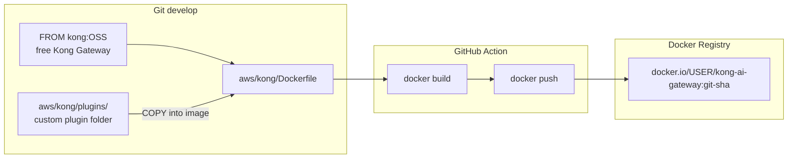
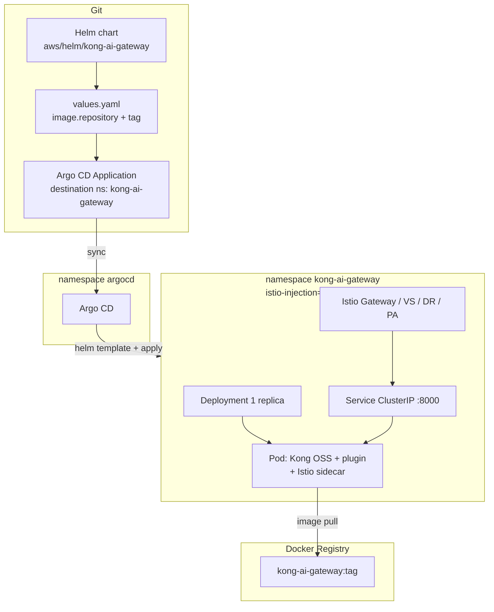

# Kong AI Gateway — image, Helm, Argo CD

Target flow. **Docker Registry (Docker Hub)**, not ECR. Namespace `kong-ai-gateway` already exists. Argo CD in `argocd` deploys this Helm chart.

**Free image:** Kong Gateway OSS (`kong:3.9`). Dockerfile extends it and `COPY`s `aws/kong/plugins/custom-header`.

---

## Folders

```text
.github/workflows/docker-publish.yml
aws/kong/Dockerfile
aws/kong/plugins/custom-header/
aws/helm/kong-ai-gateway/          # this chart
aws/argocd/kong-ai-gateway.yaml    # Argo CD Application
```

The plugin lives **outside** this Helm chart. The Dockerfile copies it **into** the image. Helm only names the image (`values.yaml` `image.repository` + `image.tag`).

---

## 1. Build and ship the image




---

## 2. Argo CD deploys the Helm chart

Argo CD does **not** build Docker images. It reads this chart and applies it to namespace **`kong-ai-gateway`**.



Order already done vs next:

| Step | Status |
| --- | --- |
| Terraform EKS | done |
| Namespaces `argocd` + `kong-ai-gateway` | done |
| Argo CD install | done |
| Dockerfile `FROM kong` + plugin COPY | done (`aws/kong`) |
| GitHub Action build/push | done (Actions → Docker publish Kong AI Gateway) |
| Argo CD Application for this chart | done (`aws/argocd/kong-ai-gateway.yaml`) |

---

## 3. What this Helm chart creates (when Argo syncs)

| Object | Notes |
| --- | --- |
| Deployment | 1 pod, image from Docker Registry |
| Service | ClusterIP port 8000 — **no NLB** (no extra AWS $) |
| ServiceAccount | |
| Istio Gateway, VirtualService, DestinationRule, PeerAuthentication | only if `istio.enabled` |

No `kind: Namespace` here. Namespace chart owns `kong-ai-gateway`.

---

## Cost

| Piece | Extra AWS $ |
| --- | --- |
| Custom image in Docker Hub / registry | $0 on AWS (not ECR) |
| Kong pod on existing t3.medium | $0 extra if it fits |
| ClusterIP Service | $0 |
| LoadBalancer / NLB | **do not enable** (~$0.66/day) |
