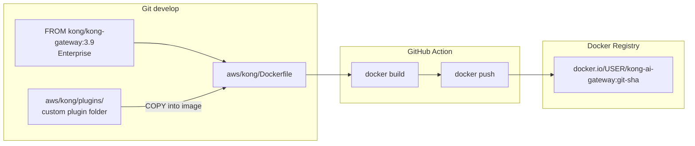
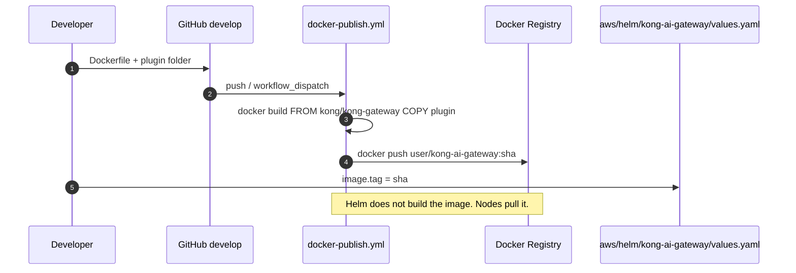
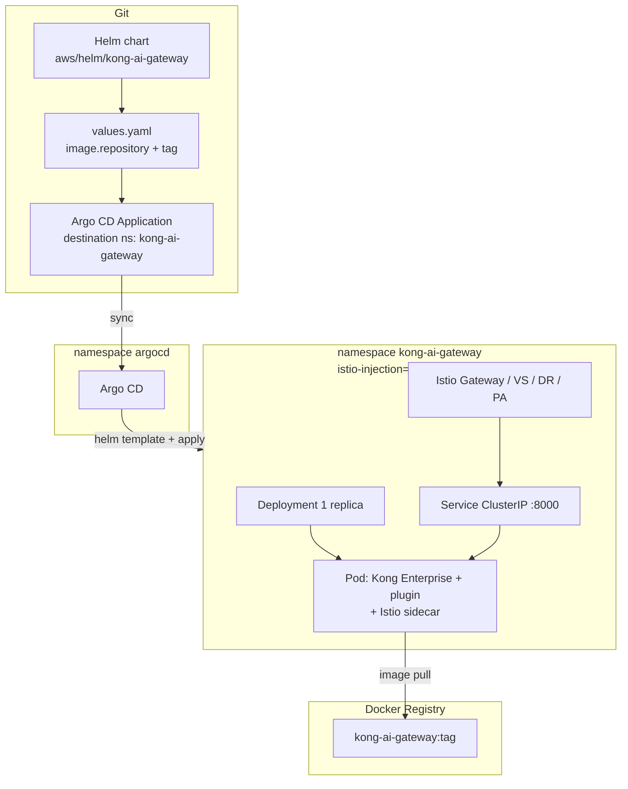
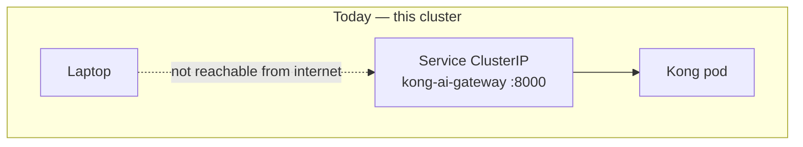
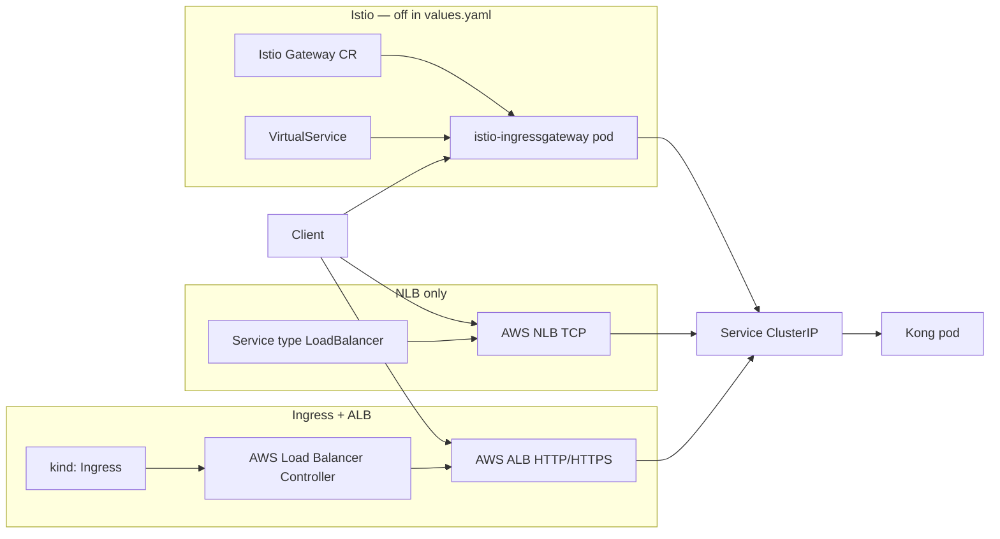
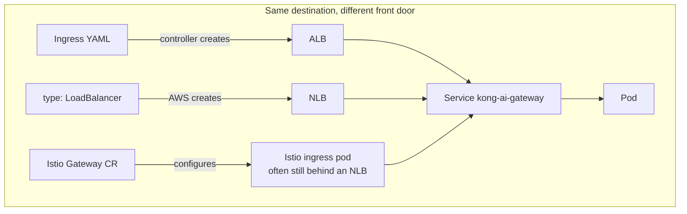

# Kong AI Gateway — image, Helm, Argo CD

Target flow. **Docker Registry (Docker Hub)**, not ECR. Namespace `kong-ai-gateway` already exists. Argo CD in `argocd` deploys this Helm chart.

**Base image:** Kong Gateway Enterprise (`kong/kong-gateway:3.9`). Dockerfile extends it and `COPY`s `aws/kong/plugins/custom-header`. Not Kong Konnect (no login dashboard in this image).

---

## Folders

```text
.github/workflows/docker-publish.yml
aws/kong/Dockerfile
aws/kong/plugins/custom-header/
aws/helm/kong-ai-gateway/          # this chart
aws/argocd/kong-ai-gateway.yaml    # Argo CD Application
```

The plugin lives **outside** this Helm chart. The Dockerfile copies it **into** the image. Helm only names the image (`values.yaml` `image.repository` + `image.tag`).

---

## 1. Build and ship the image





---

## 2. Argo CD deploys the Helm chart

Argo CD does **not** build Docker images. It reads this chart and applies it to namespace **`kong-ai-gateway`**.



Order already done vs next:

| Step | Status |
| --- | --- |
| Terraform EKS | done |
| Namespaces `argocd` + `kong-ai-gateway` | done |
| Argo CD install | done |
| Dockerfile `FROM kong/kong-gateway` + plugin COPY | done (`aws/kong`) |
| GitHub Action build/push | done (Actions → Docker publish Kong AI Gateway) |
| Argo CD Application for this chart | done (`aws/argocd/kong-ai-gateway.yaml`) |

---

## 3. What this Helm chart creates (when Argo syncs)

| Object | Notes |
| --- | --- |
| Deployment | 1 pod, image from Docker Registry |
| Service | ClusterIP port 8000 — **no NLB** (no extra AWS $) |
| ServiceAccount | |
| Istio Gateway, VirtualService, DestinationRule, PeerAuthentication | only if `istio.enabled` |

No `kind: Namespace` here. Namespace chart owns `kong-ai-gateway`.

---

## 4. ClusterIP, Ingress, ALB, NLB, Istio Gateway

EKS does **not** turn on Ingress by itself. If you add nothing, the Service stays **ClusterIP** (this chart). Nothing outside the cluster can call Kong.

| Piece | What it is | Reads HTTP Host/path? | This chart |
| --- | --- | --- | --- |
| **Service ClusterIP** | In-cluster VIP only | No | **On** (`service.type: ClusterIP`) |
| **Ingress** | Kubernetes YAML: host/path → Service | Yes (rules) | Not used |
| **ALB** | AWS Layer-7 load balancer | Yes | Not created |
| **NLB** | AWS Layer-4 load balancer (TCP) | No | **On** — Istio `istio-ingressgateway` Service |
| **Istio Gateway** | Config for Istio’s ingressgateway pods | Yes (with VirtualService) | **On** (`istio.enabled: true`, host `*`) |

**Ingress** is the wish. On EKS, **AWS Load Balancer Controller** reads Ingress and creates an **ALB**. Without that controller, Ingress YAML does nothing.

**NLB** usually skips Ingress: `Service type: LoadBalancer` → AWS NLB → Service → Pod.







ServiceAccount is **not** on this path. It is pod identity, not how traffic enters.

---

## 5. Cost

| Piece | Extra AWS $ |
| --- | --- |
| Custom image in Docker Hub / registry | $0 on AWS (not ECR) |
| Kong pod on existing t3.medium | $0 extra if it fits |
| ClusterIP Service | $0 |
| LoadBalancer / NLB | Istio ingressgateway ≈ **$0.66/day** extra |
