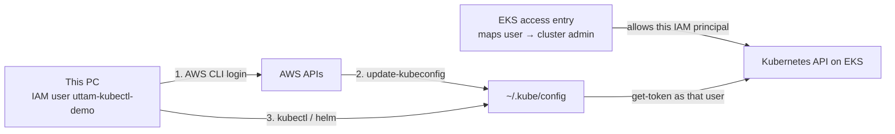

# Connect to EKS and deploy namespaces

Cluster: **`kong-ai-dev`** · Region: **`us-east-2`** · Account: **`593024667763`**

This is **not** Terraform. Namespaces are Kubernetes objects. `./aws/helm/namespace/install.sh` writes kubeconfig, enables API auth if needed, grants this IAM user an access entry, then Helm-creates the namespaces.



---

## What kubeconfig is

**kubeconfig** is a YAML file on **this laptop**: `~/.kube/config`.

It tells `kubectl` and Helm:

- cluster URL (the EKS API endpoint)
- which AWS identity to use (`aws eks get-token`)
- current context (which cluster you are talking to)

It is **not** in this git repo. Never commit it.

| | Need kubeconfig? |
| --- | --- |
| `terraform apply` in HCP | No (OIDC) |
| `./install.sh` / `kubectl` / `helm` | **Yes**, on this PC |

AWS login alone is not enough. AWS APIs ≠ Kubernetes API.

---

## How to get / update kubeconfig

**Needed on this PC**

- AWS CLI logged in (`aws sts get-caller-identity` shows `uttam-kubectl-demo`)
- `kubectl`
- `helm` (for namespace install)
- IAM permission to call `eks:DescribeCluster`
- An **EKS access entry** (or aws-auth) so that IAM user is allowed on the cluster. Without it, kubeconfig writes successfully but `kubectl get ns` returns **Unauthorized**.

`install.sh` runs `aws eks update-kubeconfig` for you. To do it by hand:

```bash
aws eks update-kubeconfig --name kong-ai-dev --region us-east-2
kubectl config current-context
```

You should see:

`arn:aws:eks:us-east-2:593024667763:cluster/kong-ai-dev`

---

## What an EKS access entry is

An **access entry** is an AWS object **on the EKS cluster**. It answers: *which IAM user or role is allowed to call this cluster’s Kubernetes API, and with which Kubernetes permissions?*

It is **not**:

| Thing | What it actually is |
| --- | --- |
| kubeconfig | File on your laptop (how to *reach* the API) |
| IAM policy on the user | Permission to call AWS APIs (`eks:DescribeCluster`, EC2, …) |
| `aws sts assume-role` | Temporary AWS keys. kubectl here uses the **IAM user** directly |
| A namespace | Unrelated |

You need **both**:

1. **kubeconfig** → kubectl knows the URL and uses `aws eks get-token` as `uttam-kubectl-demo`
2. **access entry** → EKS accepts that token and treats the user as a Kubernetes admin

Without (2), `update-kubeconfig` succeeds but `kubectl get ns` returns **`Unauthorized`**. That happened here: Terraform created the cluster as IAM role **`hcp-terraform-run`**. That role is the cluster creator. Your laptop user was **not** included until we added an access entry.

```text
IAM user uttam-kubectl-demo
        │
        │  access entry on cluster kong-ai-dev
        │  policy: AmazonEKSClusterAdminPolicy
        │  scope: whole cluster
        ▼
Kubernetes API  (create namespaces, pods, helm installs)
```

**Cost:** $0. Access entries are IAM-to-Kubernetes mappings, not extra EC2.

**AWS console:** EKS → Clusters → `kong-ai-dev` → **Access** tab. You should see principal `arn:aws:iam::593024667763:user/uttam-kubectl-demo` with **AmazonEKSClusterAdminPolicy**.

Authentication mode must be **`API_AND_CONFIG_MAP`** (or `API`). `CONFIG_MAP` only cannot use access entries.

`install.sh` switches `CONFIG_MAP` → `API_AND_CONFIG_MAP` if needed, then creates this access entry for whoever `aws sts get-caller-identity` is. Re-run the script after a cluster recreate; the AWS calls are idempotent.

HCP Terraform still uses role **`hcp-terraform-run`** (OIDC). That is a different principal. Helm on this PC does **not** assume that role.

---

## What you need to deploy namespaces

1. Cluster **ACTIVE** (Terraform already applied).
2. AWS CLI logged in as the laptop user (`uttam-kubectl-demo`).
3. From the repo root:

```bash
./aws/helm/namespace/install.sh
```

That one script: kubeconfig → `API_AND_CONFIG_MAP` if needed → access entry → Helm namespaces.

That Helm chart creates:

| Namespace | Purpose |
| --- | --- |
| `argocd` | Argo CD (install next) |
| `kong-ai-gateway` | Kong + Istio injection label |

Argo CD does **not** create these. They must exist first.

---

## How to see namespaces

**kubectl (source of truth)**

```bash
kubectl get ns
kubectl get namespace argocd kong-ai-gateway -o yaml
```

**AWS console — partly**

- **EC2 / VPC / EKS cluster page:** you see the cluster and the node. You do **not** see Kubernetes namespace names as first-class AWS resources (there is no “Namespace” in VPC).
- **EKS → Clusters → `kong-ai-dev` → Resources** (or Workloads): AWS can list namespaces and pods **if** the console identity has cluster access. It is a view of the Kubernetes API, not a separate AWS billable resource.

If the Resources tab is empty or Access Denied, use kubectl. That is normal.

---

## How to see pods

After namespaces exist, there are **no app pods yet** until Argo CD / Kong are installed. You will still see kube-system pods (CNI, CoreDNS, kube-proxy) and the node.

```bash
# all namespaces
kubectl get pods -A

# one namespace
kubectl get pods -n argocd
kubectl get pods -n kong-ai-gateway
kubectl get pods -n kube-system

# more detail
kubectl get pods -n argocd -o wide
kubectl describe pod -n argocd <pod-name>
kubectl logs -n argocd <pod-name>
```

AWS console: **EKS → kong-ai-dev → Resources → Pods** (same caveat as namespaces). EC2 shows the **worker instance**, not each container.

---

## If `kubectl` says Unauthorized

kubeconfig is fine; the **access entry** is missing, the wrong principal, or the cluster is still `CONFIG_MAP`. Re-run `./aws/helm/namespace/install.sh`. It waits for the auth-mode update before creating the entry.
