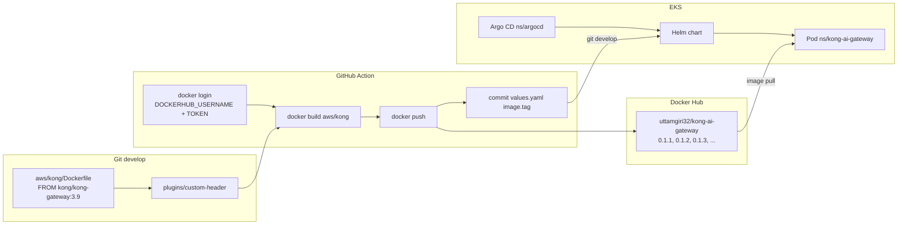

# Docker pipeline — Kong AI Gateway image

End-to-end: **Dockerfile → GitHub Action → Docker Hub → Helm → Argo CD → EKS**. Not ECR. Not the Terraform Action.

Workflow file: `.github/workflows/docker-publish.yml`  
Name in GitHub: **Docker publish Kong AI Gateway**  
Trigger: **Run workflow** only (`workflow_dispatch`). A git push does **not** build.



---

## 1. Docker Hub login (you, locally)

You need a [Docker Hub](https://hub.docker.com) account. GitHub login is not Docker login.

**Access token (use this, not your Hub password)**

1. https://hub.docker.com → Account Settings → **Personal access tokens**
2. New token, permission **Read, Write, Delete**
3. Copy it once

**CLI**

```bash
docker login
# Username: uttamgiri32
# Password: the access token
```

Check:

```bash
docker info | grep Username
```

---

## 1b. Do you need to create a repository on Docker Hub?

**For a personal account: no, not required.** The first `docker push` of `uttamgiri32/kong-ai-gateway:0.1.1` **creates** the repo under your user. The Action does that.

You **cannot** push to a name that is not yours. The image must be `DOCKERHUB_USERNAME/kong-ai-gateway`, not `someone-else/kong-ai-gateway`.

**Optional — create it empty in the UI first** (same result, easier to see before the first run):

1. https://hub.docker.com → **Create repository**
2. Name: **`kong-ai-gateway`** (must match the Action tag)
3. Visibility: **Public** (free) or Private (Hub plan)
4. Create

You should then see: `https://hub.docker.com/r/<YOURUSER>/kong-ai-gateway`  
Tags stay empty until the GitHub Action push succeeds.

This is **Docker Hub**, not GitHub Packages and not AWS ECR. Do not create an ECR repository for this pipeline.

---

## 2. GitHub secrets (so the Action can log in)

Repo **Settings → Secrets and variables → Actions → New repository secret**:

| Secret | Value |
| --- | --- |
| `DOCKERHUB_USERNAME` | Docker Hub username (same as `docker login`) |
| `DOCKERHUB_TOKEN` | Personal access token from step 1 |

The Action uses those here:

```yaml
username: ${{ secrets.DOCKERHUB_USERNAME }}
password: ${{ secrets.DOCKERHUB_TOKEN }}
```

Public people **cannot** run this workflow on your repo (needs write access). They also cannot read these secrets.

GitHub secret `DOCKERHUB_USERNAME` must be **`uttamgiri32`**. Helm already uses `docker.io/uttamgiri32/kong-ai-gateway`.

---

## 3. Run the pipeline

1. GitHub → **Actions**
2. **Docker publish Kong AI Gateway**
3. **Run workflow**
4. Use workflow from **`develop`**
5. Run (no tag field)

What the job does:

1. Checkout `aws/kong`
2. Read `image.tag` from `values.yaml` and add **1** to the patch (`0.1.0` → `0.1.1` → `0.1.2`)
3. `docker login` to Docker Hub
4. `docker build` (`FROM kong/kong-gateway:3.9`, `COPY` plugin + `kong.yml`)
5. `docker push`
   - `docker.io/uttamgiri32/kong-ai-gateway:<version>`
   - `docker.io/uttamgiri32/kong-ai-gateway:<git-sha>`
6. Write that version into `aws/helm/kong-ai-gateway/values.yaml` `image.tag` and **commit + push** to the same branch so Argo CD deploys it

Watch the job log for `pushing` / `digest` and `chore: kong-ai-gateway image tag`.

---

## 4. See the images

**Docker Hub website**

https://hub.docker.com/r/uttamgiri32/kong-ai-gateway/tags

You should see the semver tag (`0.1.1`, then `0.1.2`, …) and the commit SHA.

**CLI (after `docker login`)**

```bash
docker pull docker.io/uttamgiri32/kong-ai-gateway:0.1.1
docker images | grep kong-ai-gateway
```

There is **no** image in AWS ECR or in the EKS console. AWS only sees the image after a **node pulls** it for a pod.

---

## 5. Helm + Argo CD (after the image exists)

Helm does not build. It only names the image. Starting seed is `0.1.0`; the Action writes the next patch on each run:

```yaml
# aws/helm/kong-ai-gateway/values.yaml
image:
  repository: docker.io/uttamgiri32/kong-ai-gateway
  tag: "0.1.0"
  pullPolicy: IfNotPresent
```

Register the app with Argo CD (namespace `kong-ai-gateway` and Argo CD must already exist):

```bash
./aws/argocd/install.sh
```

Argo CD (namespace `argocd`) syncs chart `aws/helm/kong-ai-gateway` into namespace **`kong-ai-gateway`**. The node **pulls** from Docker Hub.

```bash
kubectl get application -n argocd
kubectl get pods -n kong-ai-gateway
kubectl get svc -n kong-ai-gateway
```

Argo UI: **http://localhost:8080** (port-forward `argocd-server`). App name: `kong-ai-gateway`.

Kong Service is **ClusterIP** (no public URL, no NLB). Probe the pod later with port-forward if you want:

```bash
kubectl -n kong-ai-gateway port-forward svc/kong-ai-gateway 8000:8000
# http://localhost:8000
```

---

## Full order

| # | What | Where |
| --- | --- | --- |
| 1 | Docker Hub account + token | hub.docker.com |
| 2 | `docker login` (optional, to inspect images) | this PC |
| 3 | GitHub secrets `DOCKERHUB_USERNAME` / `DOCKERHUB_TOKEN` | repo Settings |
| 4 | Run **Docker publish Kong AI Gateway** from `develop` | GitHub Actions |
| 5 | Confirm tags on Docker Hub | hub.docker.com/r/…/tags |
| 6 | Helm `image.repository` matches that username | `values.yaml` |
| 7 | `./aws/argocd/install.sh` | EKS via kubectl |
| 8 | Pods Running | `kubectl get pods -n kong-ai-gateway` |

Do **not** use **Terraform workloads** for this. That Action only plans/applies AWS VPC/EKS.
