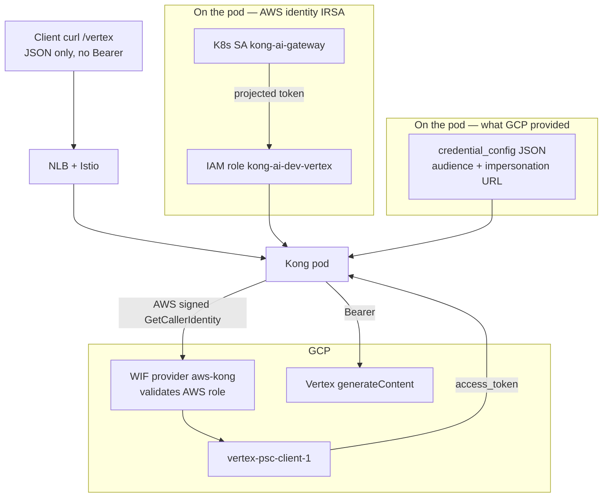

# What GCP provides, how the Kong pod uses it, what Terraform does

Companion: **[VERTEX-WIF.md](VERTEX-WIF.md)** (full WIF vs JSON-key). Lab key: **[VERTEX-JSON-KEY.md](VERTEX-JSON-KEY.md)**.

This file is only: **GCP paste → Kong pod → Vertex**, and **what this repo’s Terraform must create**. Not implemented yet. Terraform stays VPC + EKS + IAM (no Helm). Helm/Argo still own the Kong pod.

---

## What GCP provides

**Already theirs (not a paste):**

| Item | Value |
| --- | --- |
| Project | `bootstrap-prj-501802` |
| SA Kong will become | `vertex-psc-client-1@bootstrap-prj-501802.iam.gserviceaccount.com` |
| Vertex URL | `POST https://aiplatform.googleapis.com/v1/projects/bootstrap-prj-501802/locations/global/publishers/google/models/gemini-2.5-pro:generateContent` |

**Names they will create (not live until GCP TFE apply):**

| Item | Agreed ID |
| --- | --- |
| WIF pool | `aws-kong-vertex` |
| WIF provider (type AWS) | `aws-kong` |

Those two IDs are a **contract**. GCP builds them. You do not create them in AWS.

**What they paste to you after apply** (this is the real “GCP provided” blob):

```bash
terraform output -json vertex_aws_wif
```

You need two fields from that JSON:

| Field | What it is | Secret? |
| --- | --- | --- |
| `audience` | Which GCP provider to talk to (`//iam.googleapis.com/projects/NUMBER/.../providers/aws-kong`) | No. It is a URL path. |
| `credential_config` | JSON that tells a Google client: use **AWS creds**, hit GCP STS, then **impersonate** the SA | No private key. Not a JSON key. Still do not put it in a public gist. |

They do **not** send: JSON key, Bearer token, JWKS, access keys, or the EKS OIDC issuer.

You confirm back to them: account `593024667763` + role ARN `arn:aws:iam::593024667763:role/kong-ai-dev-vertex`.

---

## How the Kong pod uses it

The paste is **not** a token. It is **directions** for minting a token. IRSA is the **AWS identity**. Together they impersonate the GCP SA.

```text
Your curl  →  NLB  →  Istio  →  Kong pod
                                  │
                                  ├─ 1. IRSA: pod already has AWS creds
                                  │     (role kong-ai-dev-vertex)
                                  │
                                  ├─ 2. Read GCP credential_config
                                  │     (audience + “use AWS, then impersonate”)
                                  │
                                  ├─ 3. Sign AWS GetCallerIdentity
                                  │     GCP WIF provider aws-kong validates that
                                  │
                                  ├─ 4. GCP STS → impersonate vertex-psc-client-1
                                  │     → Google access_token (~1h)
                                  │
                                  └─ 5. Kong → Vertex  Authorization: Bearer …
```



**IRSA** (Terraform + Helm annotation) puts this on the pod automatically:

```text
AWS_ROLE_ARN=arn:aws:iam::593024667763:role/kong-ai-dev-vertex
AWS_WEB_IDENTITY_TOKEN_FILE=/var/run/secrets/eks.amazonaws.com/serviceaccount/token
```

**GCP `credential_config`** (Helm ConfigMap, after they paste) is a file, typically:

```text
GOOGLE_APPLICATION_CREDENTIALS=/var/run/gcp-wif/credential-config.json
```

That file says: token type is AWS, audience is their provider, then impersonate `vertex-psc-client-1@…`. Google’s client (or Kong AI Proxy GCP auth, or a small plugin) reads AWS env + this file. **Kong’s generic httpbin proxy does not do this today.** `/vertex` plus a token helper still have to be added in Helm/`kong.yml`.

You never put `gcloud` in the image. You never mount `sa.json`.

---

## Split: who creates what

| Layer | Tool | Creates |
| --- | --- | --- |
| GCP | Their TFE | Pool `aws-kong-vertex`, provider `aws-kong`, `workloadIdentityUser` on the SA. Output `vertex_aws_wif`. |
| AWS IAM | **This repo Terraform workloads** | EKS OIDC provider + role `kong-ai-dev-vertex`. Output account ID + role ARN. |
| Kong SA | **Helm** (Argo) | Annotation `eks.amazonaws.com/role-arn`. ConfigMap from `credential_config`. Env `GOOGLE_APPLICATION_CREDENTIALS`. |
| Kong route | **Image `kong.yml`** | `/vertex` → `aiplatform.googleapis.com` (or `ai-proxy`). Mint Bearer from ADC. |

HCP OIDC in `bootstrap/aws_oidc.tf` is **not** this. Leave `hcp-terraform-run` alone.

---

## What Terraform in this repo must create

Workspace: **workloads** (`aws/terraform/workloads/dev`), not bootstrap, not Docker.

Code: `aws/terraform/workloads/dev/infra/irsa_vertex.tf`. Not applied yet.

Helm annotation is in `aws/helm/kong-ai-gateway` (`irsa.roleArn`). Apply **Terraform first**, then let Argo sync — otherwise the pod cannot assume a missing role. ConfigMap from GCP `credential_config` is still waiting on their paste. `/vertex` is still not in `kong.yml`.

### 1. IAM OIDC provider for the EKS cluster

Issuer is the **cluster** OIDC URL (`aws_eks_cluster.this.identity[0].oidc[0].issuer`), not `app.terraform.io`.

Same resource type as bootstrap, different issuer:

```hcl
resource "aws_iam_openid_connect_provider" "eks" {
  url             = aws_eks_cluster.this.identity[0].oidc[0].issuer
  client_id_list  = ["sts.amazonaws.com"]
  thumbprint_list = [data.tls_certificate.eks_oidc.certificates[0].sha1_fingerprint]
}
```

Skip if the cluster already has this provider (one per cluster).

### 2. IAM role `kong-ai-dev-vertex`

No Vertex policy. No GCP. Trust only the Kong SA:

```text
Action: sts:AssumeRoleWithWebIdentity
Federated: this cluster’s OIDC provider
sub = system:serviceaccount:kong-ai-gateway:kong-ai-gateway
aud = sts.amazonaws.com
```

Role name must stay `kong-ai-dev-vertex` so GCP’s attribute condition matches.

### 3. Terraform outputs (confirm back to GCP)

```hcl
output "vertex_irsa" {
  value = {
    aws_account_id = "593024667763"
    role_name      = "kong-ai-dev-vertex"
    role_arn       = aws_iam_role.kong_ai_vertex.arn
  }
}
```

Do **not** output the EKS OIDC issuer, JWKS, or any keys. GCP told you not to send those.

### 4. What Terraform must **not** create

- Helm release / annotation (Argo)
- ConfigMap of `credential_config` (Helm, after GCP paste)
- `/vertex` in `kong.yml` (Docker image)
- JSON key Secret
- Changes to `bootstrap/aws_oidc.tf`

---

## After GCP paste — Helm (not Terraform)

When `terraform output -json vertex_aws_wif` arrives:

1. Put `credential_config` in a ConfigMap (or Secret if you prefer). Mount it in the Kong deployment.
2. Set `GOOGLE_APPLICATION_CREDENTIALS` to that path.
3. Annotate ServiceAccount:

```yaml
eks.amazonaws.com/role-arn: arn:aws:iam::593024667763:role/kong-ai-dev-vertex
```

4. Restart Kong so IRSA volume + mount appear.
5. Ship `/vertex` (new image if `kong.yml` changes).

Until the paste exists, Helm cannot finish WIF. You **can** still apply the IAM role in Terraform; GCP can bind WIF to the agreed role ARN before or after.

---

## Order

```text
1. AWS Terraform: EKS OIDC + role kong-ai-dev-vertex
2. Confirm to GCP: account ID + role ARN
3. GCP TFE: pool + provider + workloadIdentityUser
4. GCP: terraform output -json vertex_aws_wif  →  paste audience + credential_config
5. Helm: SA annotation + mount credential_config
6. Image: /vertex uses ADC Bearer
7. curl http://<NLB>/vertex/...   (you send no Authorization)
```

Step 1 and 3 can overlap if both sides use the agreed role ARN.

---

## Checklist

| Done | Who | Item |
| --- | --- | --- |
| | AWS TF | EKS OIDC provider + role `kong-ai-dev-vertex` |
| | AWS | Send GCP account ID + role ARN only |
| | GCP | Pool `aws-kong-vertex`, provider `aws-kong` |
| | GCP | Paste `vertex_aws_wif` audience + credential_config |
| | Helm | SA annotation + ConfigMap mount |
| | Image | `/vertex` + ADC / ai-proxy |
| | You | curl NLB, no Bearer |
