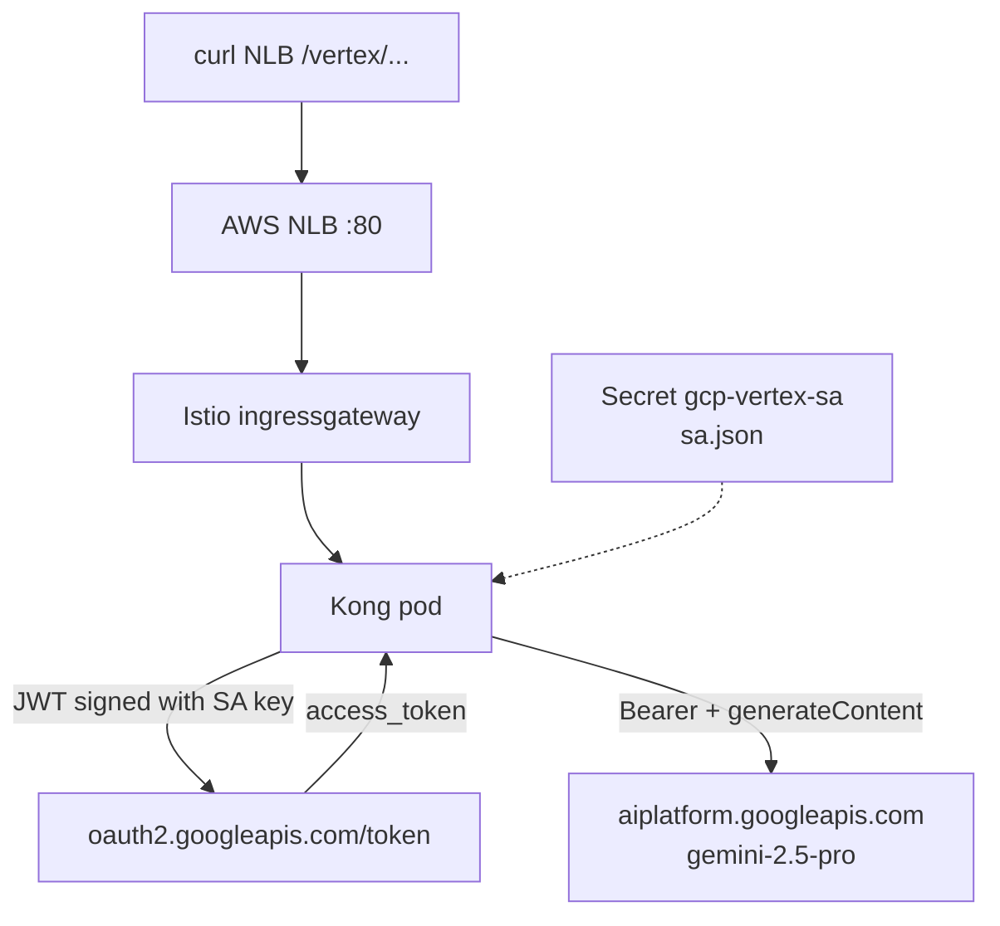

# Call Vertex Gemini from Kong on AWS (JSON key)

**Lab approach:** put the GCP service account JSON on the Kong pod. Kong mints a Google access token and calls Vertex. No `gcloud` in the image. No GCP Private Service Connect from AWS.

**Better (no JSON key):** AWS IRSA + GCP WIF impersonating the same SA — **[VERTEX-WIF.md](VERTEX-WIF.md)**.

This is **not implemented in Helm/`kong.yml` yet**. This file is the JSON-key plan.

Laptop proof (already works for you):

```bash
export CLIENT_SA=vertex-psc-client-1@bootstrap-prj-501802.iam.gserviceaccount.com
TOKEN=$(gcloud auth print-access-token --impersonate-service-account="${CLIENT_SA}")

curl -sS -X POST \
  "https://aiplatform.googleapis.com/v1/projects/bootstrap-prj-501802/locations/global/publishers/google/models/gemini-2.5-pro:generateContent" \
  -H "Authorization: Bearer ${TOKEN}" \
  -H "Content-Type: application/json" \
  -d '{"contents":{"role":"user","parts":{"text":"Reply with exactly: OK"}}}'
```

That is **your user impersonating the SA**. The pod cannot do that. The pod uses a **JSON key that is the SA**.

```text
Mac:   you  →  impersonate vertex-psc-client-1  →  token  →  Vertex

Pod:   sa.json (private key of that SA)
         →  signed JWT
         →  POST oauth2.googleapis.com/token
         →  access_token (~1 hour)
         →  Authorization: Bearer
         →  Vertex generateContent
```

The `psc` in the SA name is for **GCP-VPC Private Service Connect**. From EKS you use the **public** API: `aiplatform.googleapis.com`. PSC is not reachable from the AWS VPC unless you add VPN/Interconnect.

---

## What you need (three pieces)

| Piece | Meaning |
| --- | --- |
| Network | Kong pod can HTTPS to `aiplatform.googleapis.com` and `oauth2.googleapis.com` |
| Identity | JSON key of `vertex-psc-client-1@…` as a Kubernetes Secret, **not** in git |
| Kong route | Path on the NLB (e.g. `/vertex`) → Vertex URL, Kong attaches Bearer |

Today `kong.yml` only has `https://httpbin.org` on `/`. Vertex is a **new** service/route. That is a Docker image change (declarative config is in the image) plus a Helm mount for the secret.

---

## 1. Authenticate — how, without gcloud

The JSON contains `client_email` and `private_key`.

```text
Kong
  1. JWT  iss = client_email
          scope = https://www.googleapis.com/auth/cloud-platform
          aud = https://oauth2.googleapis.com/token
  2. Sign with private_key
  3. POST https://oauth2.googleapis.com/token
       grant_type = urn:ietf:params:oauth:grant-type:jwt-bearer
  4. Google returns access_token
  5. POST Vertex with  Authorization: Bearer <access_token>
```

Do **not** paste a laptop `TOKEN` into `kong.yml`. It expires in about an hour. Kong (or `ai-proxy`) must mint and cache tokens.

SA must already have Vertex access (`roles/aiplatform.user` on `bootstrap-prj-501802`). Your impersonation curl proved the **SA** can call Gemini, not that the **pod** can.

---

## 2. JSON key on the cluster (never git)

GCP: IAM → service account `vertex-psc-client-1` → Keys → add JSON key. Download once.

```bash
# file stays on the laptop only
kubectl -n kong-ai-gateway create secret generic gcp-vertex-sa \
  --from-file=sa.json=./vertex-psc-client-1.json
```

Helm must mount it on the gateway container (not in the chart today):

```yaml
# deployment.yaml — gateway container
env:
  - name: GOOGLE_APPLICATION_CREDENTIALS
    value: /var/run/secrets/gcp/sa.json
volumeMounts:
  - name: gcp-sa
    mountPath: /var/run/secrets/gcp
    readOnly: true
volumes:
  - name: gcp-sa
    secret:
      secretName: gcp-vertex-sa
```

Pod path: `/var/run/secrets/gcp/sa.json`.

Do **not** `COPY` the JSON in `Dockerfile`. Do **not** commit `vertex-psc-client-1.json`. Do **not** put the JSON in `kong.yml`.

---

## 3. Kong route to Vertex

### Option A — reverse proxy (works in DB-less without AI plugin license)

Add a service next to `mock`. A plugin (or `pre-function`) reads `sa.json`, caches the token, sets `Authorization`.

```yaml
services:
  - name: mock
    url: https://httpbin.org
    routes:
      - name: mock-route
        paths:
          - /
  - name: vertex-gemini
    url: https://aiplatform.googleapis.com
    routes:
      - name: vertex-route
        paths:
          - /vertex
        strip_path: true
```

`strip_path: true` means:

```text
POST http://<NLB>/vertex/v1/projects/bootstrap-prj-501802/locations/global/publishers/google/models/gemini-2.5-pro:generateContent

Kong forwards:

POST https://aiplatform.googleapis.com/v1/projects/bootstrap-prj-501802/locations/global/publishers/google/models/gemini-2.5-pro:generateContent
Authorization: Bearer <minted>
```

You still write a small plugin (or use `pre-function`) for the token. `request-transformer` cannot mint JWTs by itself.

### Option B — Kong `ai-proxy` (Enterprise AI plugin)

Kong mints the token from the JSON and speaks Gemini/Vertex. Client can use an OpenAI-shaped `/chat/completions`; Kong maps to Vertex.

Needs `ai-proxy` in `KONG_PLUGINS` (often already in `bundled` on `kong/kong-gateway`) and often a **`KONG_LICENSE_DATA`**. If Manager shows license limits, this plugin may not run until you add a trial/paid license.

Config sketch (do not put the JSON in git — use an env var or file Kong can read):

```yaml
# on the vertex route only
plugins:
  - name: ai-proxy
    config:
      route_type: llm/v1/chat
      auth:
        gcp_use_service_account: true
        gcp_service_account_json: "{...from secret, not from git...}"
      model:
        provider: gemini
        name: gemini-2.5-pro
        options:
          vertex_project: bootstrap-prj-501802
          vertex_location: global
```

Prefer **A** for this lab if there is no license. Prefer **B** if AI Gateway plugins are licensed.

After `kong.yml` / plugin changes: **Actions → Docker publish Kong AI Gateway** (manual), then wait for Argo. Helm mount can ship without a new image.

---

## 4. Call it (after mount + new image)

Not `gcloud`. Hit the **NLB** (Istio :80 → Kong :8000):

```bash
NLB=$(kubectl -n istio-ingress get svc istio-ingressgateway -o jsonpath='{.status.loadBalancer.ingress[0].hostname}')

curl -sS -X POST \
  "http://${NLB}/vertex/v1/projects/bootstrap-prj-501802/locations/global/publishers/google/models/gemini-2.5-pro:generateContent" \
  -H "Content-Type: application/json" \
  -d '{"contents":{"role":"user","parts":{"text":"Reply with exactly: OK"}}}'
```

No `Authorization` on this curl. Kong adds it.

---

## 5. Egress check (before auth)

```bash
kubectl -n kong-ai-gateway exec deploy/kong-ai-gateway -c gateway -- \
  wget -qO- --timeout=8 https://oauth2.googleapis.com/ | head
```

If this fails, fix Istio egress / network first (`ServiceEntry` if outbound is `REGISTRY_ONLY`). Token minting will fail the same way.

---

## Flow



Istio Gateway/VS only deliver HTTP to Kong. They do not talk to Google. PeerAuthentication / DestinationRule apply to **in-mesh** hops (Envoy → Kong), not to Vertex.

---

## Checklist

| Done | Item |
| --- | --- |
| GCP | SA `vertex-psc-client-1@bootstrap-prj-501802` can call Vertex |
| Laptop | JSON key downloaded; **not** in git |
| Cluster | `kubectl create secret … gcp-vertex-sa` |
| Helm | Volume mount + optional `GOOGLE_APPLICATION_CREDENTIALS` |
| Kong | `/vertex` service (and token plugin or `ai-proxy`) |
| Image | Docker publish if `kong.yml` / plugin changed |
| Test | `curl http://<NLB>/vertex/...` without a Bearer |

---

## What we are not doing (this approach)

| Skip | Why |
| --- | --- |
| `gcloud` in the Dockerfile | Heavy, still needs a key or ADC |
| Impersonation from the pod | Needs a **user** or WIF; JSON key is the SA itself |
| PSC from AWS | Private IP in a GCP VPC; use public `aiplatform.googleapis.com` |
| Token in `kong.yml` | Expires |
| IRSA + GCP WIF | Better for prod; separate Terraform. Use that instead of a JSON key when you are done with the lab |

WIF (AWS IRSA → GCP pool → same SA) is the non-key version of the same Vertex call. Same Kong route; different token source.
