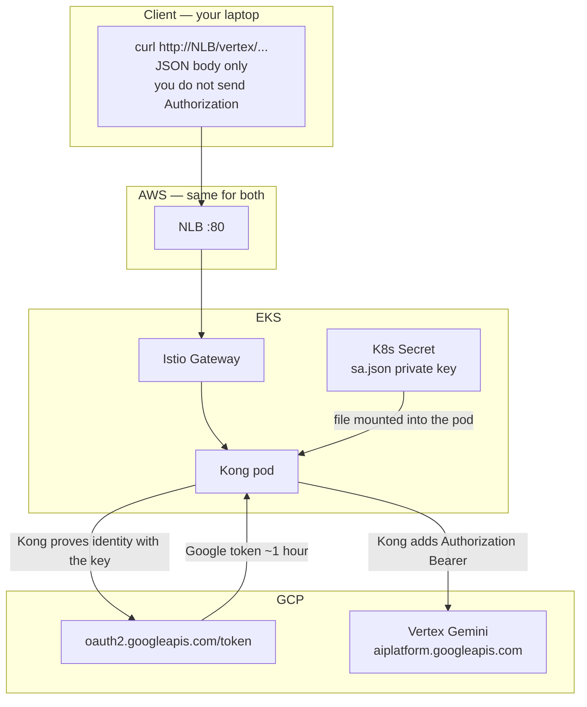
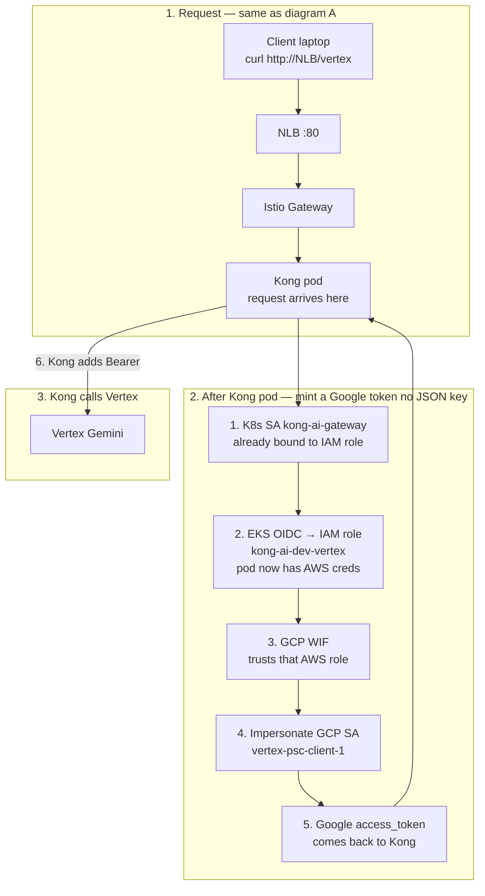
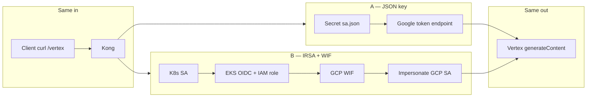

# Call Vertex Gemini from Kong on AWS (IRSA + GCP WIF)

**Better approach:** no JSON key on the pod. Kong’s Kubernetes ServiceAccount gets an **AWS IAM role** (IRSA). **GCP Workload Identity Federation** trusts that role and lets it **impersonate** `vertex-psc-client-1@bootstrap-prj-501802.iam.gserviceaccount.com`. Kong then calls Vertex with a short-lived Google token.

This is **not implemented** yet. Same public Vertex URL as the laptop curl. **PSC is not used from AWS.**

Lab (JSON key in a Secret): **[VERTEX-JSON-KEY.md](VERTEX-JSON-KEY.md)**.

How the Kong pod uses GCP’s paste (`audience` + `credential_config`) and what **this repo’s Terraform** must create: **[VERTEX-GCP-PROVIDED.md](VERTEX-GCP-PROVIDED.md)**.

Laptop proof (impersonation as **you**, not as the pod):

```bash
export CLIENT_SA=vertex-psc-client-1@bootstrap-prj-501802.iam.gserviceaccount.com
TOKEN=$(gcloud auth print-access-token --impersonate-service-account="${CLIENT_SA}")
```

WIF is that **impersonate** step for the **Kong pod**, with **AWS** as the caller instead of your user.

---

## Comparison: JSON key vs WIF

| | JSON key ([VERTEX-JSON-KEY.md](VERTEX-JSON-KEY.md)) | IRSA + GCP WIF (this file) |
| --- | --- | --- |
| What sits on the pod | `sa.json` private key in a Secret | No GCP key; only AWS IRSA |
| Who the pod “is” | The SA (the file **is** `vertex-psc-client-1`) | An AWS IAM role, then **impersonates** that SA |
| Like this repo already | A long-lived access key | HCP JWT → assume `hcp-terraform-run` |
| If the pod/node is dumped | Key works until you delete it in GCP | AWS creds expire; GCP still requires WIF match |
| Rotate | New JSON, replace Secret, restart Kong | No key to rotate; tighten IAM / WIF condition |
| Terraform | Optional (Secret is CLI) | **Yes** — IAM role + IRSA; GCP WIF binding |
| Helm | Volume mount Secret | Annotate ServiceAccount with role ARN |
| Kong route `/vertex` | Same | Same |
| Token on NLB curl | Kong adds Bearer | Kong adds Bearer |
| `gcloud` in the image | No | No |
| PSC from AWS | No | No |
| When to use | Lab, throwaway key | Anything you keep |

Same Vertex call either way. Only **how Kong mints the Bearer** changes.

```text
POST https://aiplatform.googleapis.com/v1/projects/bootstrap-prj-501802/locations/global/publishers/google/models/gemini-2.5-pro:generateContent
Authorization: Bearer <google access_token>
```

**Client** = you (laptop, `curl`). Not Kong, not GCP. You hit the NLB path `/vertex` and send JSON. You do **not** send `Authorization`. Kong adds Google’s Bearer after it gets a token.

The arrow labels in the diagrams:

| Label | Meaning |
| --- | --- |
| mount | Kubernetes puts `sa.json` into the Kong pod as a file |
| signed JWT from key | Kong uses that private key to prove “I am this GCP SA” |
| access_token ~1h | Google replies with a short-lived token |
| Bearer | Kong puts `Authorization: Bearer <that token>` on the call **to Vertex** (not on your curl) |

---

## Diagram A — JSON key (lab)

Long-lived GCP private key in a Secret. Kong **is** the SA. Same idea as an AWS access key in a file.



---

## Diagram B — IRSA + GCP WIF (this file)

Same as A until the **Kong pod**. After that, Kong has **no `sa.json`**. It must still get a Google token before it can call Vertex. That is the rest of this diagram.

Numbered steps **after the request hits Kong**:

1. The pod already has an AWS identity: K8s ServiceAccount `kong-ai-gateway` is annotated with an IAM role (IRSA). Same idea as HCP JWT → `hcp-terraform-run`.
2. AWS STS: EKS OIDC + that role → short-lived **AWS** creds on the pod.
3. Kong shows those AWS creds to **GCP WIF** (“this is AWS account 593024667763, role `kong-ai-dev-vertex`”).
4. GCP allows that role to **impersonate** `vertex-psc-client-1` (your Vertex SA).
5. Google returns an **access_token** (~1 hour) **to Kong**.
6. Kong calls Vertex with `Authorization: Bearer <that token>`. You never see this.

Your curl is still only JSON. No Bearer from you.



---

## Side by side — only the token mint differs

Client, NLB, Istio, Kong route `/vertex`, and Vertex are the same. The middle box is what changes.



Bootstrap OIDC is the same shape as the **AWS half** of B: HCP JWT → OIDC provider → `hcp-terraform-run`. Here the JWT is the **pod SA**, the role is **`kong-ai-dev-vertex`**, then GCP WIF is a second hop AWS does not have in bootstrap.

---

## Why WIF is better

1. **No long-lived GCP private key** in etcd or on the node.
2. **Same SA** you already use for Vertex (`roles/aiplatform.user`). No second Google identity for the app.
3. **Same security story as HCP:** GitHub has no AWS keys; HCP assumes a role. Kong should not carry a GCP key.
4. Stolen role creds still have to look like **that** EKS ServiceAccount in account **`593024667763`**. Stolen `sa.json` works from any laptop until the key is deleted.

JSON is still fine for a one-cluster lab you will delete with the namespace.

---

## What to build

Account and role name are already chosen. **AWS still creates** the IAM role + IRSA. GCP still creates the WIF pool/provider. After GCP’s TFE apply, they add the **output block** at the bottom of this section and paste `audience` + `credential_config` here.

Until GCP apply, use:

| GCP object | ID |
| --- | --- |
| Project | `bootstrap-prj-501802` |
| Pool | `aws-kong-vertex` |
| Provider | `aws-kong` (type AWS) |

---

### Handoff — from GCP to AWS (what AWS must build)

Create the IAM role in the **same account as EKS `kong-ai-dev`**:

```text
arn:aws:iam::593024667763:role/kong-ai-dev-vertex
```

IRSA: only this K8s SA may assume it:

```text
system:serviceaccount:kong-ai-gateway:kong-ai-gateway
```

Helm annotation on that ServiceAccount:

```yaml
eks.amazonaws.com/role-arn: arn:aws:iam::593024667763:role/kong-ai-dev-vertex
```

The role does **not** need Vertex permissions. Confirm back: **account ID + role ARN**.

Do **not** send GCP access keys, JWKS, or the EKS OIDC issuer.

---

### Handoff — from GCP (who AWS will impersonate)

```text
vertex-psc-client-1@bootstrap-prj-501802.iam.gserviceaccount.com
```

That SA already has Vertex (`roles/aiplatform.user`). GCP WIF will let **only** `kong-ai-dev-vertex` become it.

Vertex URL (public, **no PSC** from AWS):

```text
POST https://aiplatform.googleapis.com/v1/projects/bootstrap-prj-501802/locations/global/publishers/google/models/gemini-2.5-pro:generateContent
```

AWS does **not** get a JSON key or a Bearer from GCP. The Kong pod mints the Google token via WIF.

After GCP apply, GCP runs this and pastes **audience + credential_config** to AWS:

```bash
terraform output -json vertex_aws_wif
```

---

### After GCP TFE apply — output block (GCP adds this)

GCP Terraform (not this repo). Add at the bottom of their root module, then apply again if the first apply did not export it.

```hcl
output "vertex_aws_wif" {
  description = "Paste audience + credential_config to AWS. No keys."
  value = {
    project_id      = "bootstrap-prj-501802"
    pool_id         = "aws-kong-vertex"
    provider_id     = "aws-kong"
    service_account = "vertex-psc-client-1@bootstrap-prj-501802.iam.gserviceaccount.com"
    audience        = "//iam.googleapis.com/projects/${PROJECT_NUMBER}/locations/global/workloadIdentityPools/aws-kong-vertex/providers/aws-kong"
    credential_config = {
      type                              = "external_account"
      audience                          = "//iam.googleapis.com/projects/${PROJECT_NUMBER}/locations/global/workloadIdentityPools/aws-kong-vertex/providers/aws-kong"
      subject_token_type                = "urn:ietf:params:aws:token-type:aws4_request"
      token_url                         = "https://sts.googleapis.com/v1/token"
      service_account_impersonation_url = "https://iamcredentials.googleapis.com/v1/projects/-/serviceAccounts/vertex-psc-client-1@bootstrap-prj-501802.iam.gserviceaccount.com:generateAccessToken"
      credential_source = {
        environment_id                 = "aws1"
        regional_cred_verification_url = "https://sts.{region}.amazonaws.com?Action=GetCallerIdentity&Version=2011-06-15"
      }
    }
  }
}
```

Replace `${PROJECT_NUMBER}` with project `bootstrap-prj-501802`’s **number** (not the id). AWS stores audience + `credential_config` on the Kong pod (file or env). Never commit a JSON key.

---

### AWS (Terraform **workloads**, not Docker)

HCP OIDC in `bootstrap/aws_oidc.tf` is **not** this. That trusts Terraform Cloud. This trusts the **EKS cluster** so the Kong pod can assume a role.

**Already there**

| Piece | Yours |
| --- | --- |
| Account | `593024667763` |
| Cluster | `kong-ai-dev` (us-east-2) |
| Namespace | `kong-ai-gateway` |
| ServiceAccount | `kong-ai-gateway` (Helm already creates it, **no** `role-arn` yet) |
| HCP OIDC + role `hcp-terraform-run` | Terraform only — leave it |

**AWS must build** (same shape as `aws_oidc.tf`, different issuer):

| Build | What it is | Like in this repo |
| --- | --- | --- |
| 1. EKS IAM **OIDC provider** | AWS trusts this cluster’s SA tokens | `aws_iam_openid_connect_provider.tfc` — but issuer is the **cluster**, not `app.terraform.io` |
| 2. IAM **role** e.g. `kong-ai-dev-vertex` | What the Kong pod becomes in AWS | `aws_iam_role.tfc_run` (`hcp-terraform-run`) |
| 3. **Trust policy** | Only `system:serviceaccount:kong-ai-gateway:kong-ai-gateway` may `AssumeRoleWithWebIdentity` | Trust `Condition` `workspace:…:run_phase:*` on `hcp-terraform-run` |
| 4. Helm **annotation** on the existing SA | `eks.amazonaws.com/role-arn: arn:aws:iam::593024667763:role/kong-ai-dev-vertex` | How the pod knows which role to assume. Restart Kong after this. No Secret mount. |

```yaml
eks.amazonaws.com/role-arn: arn:aws:iam::593024667763:role/kong-ai-dev-vertex
```

The role does **not** need Vertex permissions. Vertex is on GCP. This role only has to be **assumable by that SA** so GCP WIF can see it.

**Do not build on AWS for this path**

- IAM user access keys for Kong
- JSON key Secret
- A second Kubernetes ServiceAccount
- Changes to HCP OIDC / `hcp-terraform-run`

GCP still builds the WIF pool + `workloadIdentityUser`. Helm/Kong still add `/vertex`.

### GCP

You do **not** create a new Vertex SA or a JSON key. Laptop curl already proved this SA can call Gemini.

**Already there**

| Piece | Yours |
| --- | --- |
| Project | `bootstrap-prj-501802` |
| Service account | `vertex-psc-client-1@bootstrap-prj-501802.iam.gserviceaccount.com` |
| Vertex permission | `roles/aiplatform.user` on that project |
| Model | `gemini-2.5-pro` on public `aiplatform.googleapis.com` |

**GCP must build** (this is the bootstrap OIDC equivalent on Google):

| Build | What it is | Like in this repo |
| --- | --- | --- |
| 1. Workload Identity **pool** `aws-kong-vertex` | A folder that says “external identities may federate here” | Empty until you add a provider |
| 2. Workload Identity **provider** `aws-kong` type **AWS** | GCP trusts AWS account `593024667763` | `aws_iam_openid_connect_provider.tfc` (HCP → AWS). Here it is AWS → GCP |
| 3. Attribute **condition** | Only IAM role `kong-ai-dev-vertex` (not every role in the account) | Trust `Condition` on `hcp-terraform-run` (`workspace:…`) |
| 4. IAM on the **existing** SA | Grant `roles/iam.workloadIdentityUser` to that WIF principal | “This AWS role may **impersonate** `vertex-psc-client-1`” — same as your gcloud `--impersonate-service-account`, but the caller is the AWS role, not you |

WIF principal looks like:

```text
principalSet://iam.googleapis.com/projects/PROJECT_NUMBER/locations/global/workloadIdentityPools/aws-kong-vertex/attribute.aws_role/arn:aws:iam::593024667763:role/kong-ai-dev-vertex
```

That binding is the only new permission on `vertex-psc-client-1`. Do not create a second SA for Kong.

**Do not build on GCP for this path**

- JSON key
- Private Service Connect from AWS
- Extra Vertex model enablement if the laptop curl already works
- `gcloud` in the Kong image

AWS still builds the EKS OIDC + IAM role. Helm annotates the Kong ServiceAccount. GCP only trusts that role and lets it impersonate the SA you already have.

### Kong (Helm + image)

**Already there**

| Piece | Yours |
| --- | --- |
| Image | `uttamgiri32/kong-ai-gateway` |
| Chart | `aws/helm/kong-ai-gateway` |
| ServiceAccount | `kong-ai-gateway` (no IRSA annotation yet) |
| `kong.yml` | httpbin only — no `/vertex` |

**Kong / Helm must build**

| Build | What it is |
| --- | --- |
| 1. Service + route `/vertex` | Proxy to `https://aiplatform.googleapis.com` (`strip_path: true`), **or** Enterprise `ai-proxy` |
| 2. Token from IRSA + WIF | ADC / plugin / `ai-proxy` — **not** `sa.json` |
| 3. Helm SA annotation | `eks.amazonaws.com/role-arn` (can ship without a new image) |
| 4. Docker publish | Only if `kong.yml` / plugin changed → Argo |

**Do not build in Kong**

- `gcloud` in the Dockerfile
- JSON key `COPY` or Secret mount (that is the lab file)
- PSC, ALB, or a second NLB for Vertex

---

## Call path (unchanged for the client)

```text
curl http://<NLB>/vertex/v1/projects/bootstrap-prj-501802/locations/global/publishers/google/models/gemini-2.5-pro:generateContent
  → Istio :80
  → Kong :8000
  → Kong mints Google token via WIF
  → aiplatform.googleapis.com  Bearer …
```

You do **not** pass `Authorization`. You do **not** run `gcloud` on that curl.

```bash
NLB=$(kubectl -n istio-ingress get svc istio-ingressgateway -o jsonpath='{.status.loadBalancer.ingress[0].hostname}')

curl -sS -X POST \
  "http://${NLB}/vertex/v1/projects/bootstrap-prj-501802/locations/global/publishers/google/models/gemini-2.5-pro:generateContent" \
  -H "Content-Type: application/json" \
  -d '{"contents":{"role":"user","parts":{"text":"Reply with exactly: OK"}}}'
```

Istio Gateway/VS only reach Kong. PeerAuthentication / DestinationRule are **in-mesh** (Envoy → Kong), not Vertex.

---

## Egress

Same as JSON: the pod must reach `aiplatform.googleapis.com` and Google’s STS/token endpoints. If Istio outbound is `REGISTRY_ONLY`, add ServiceEntries. PSC / private Google APIs stay in GCP.

---

## Checklist

| Done | Item |
| --- | --- |
| GCP | SA can call Vertex (laptop impersonation curl) |
| GCP | WIF pool `aws-kong-vertex` + provider `aws-kong` + `workloadIdentityUser` on that SA |
| GCP | `terraform output -json vertex_aws_wif` → paste audience + credential_config to AWS |
| AWS | EKS OIDC + IAM role `kong-ai-dev-vertex` + IRSA; confirm account ID + role ARN back to GCP |
| Helm | ServiceAccount annotation `eks.amazonaws.com/role-arn` |
| Kong | `/vertex` (or `ai-proxy`) using WIF/ADC, not `sa.json` |
| Image | Docker publish if `kong.yml` / plugin changed |
| Test | `curl http://<NLB>/vertex/...` with no Bearer |

---

## Mapping to identities you already use

| GCP | AWS in this repo |
| --- | --- |
| Impersonate SA `vertex-psc-client-1` | Assume role `hcp-terraform-run` (HCP) or `kong-ai-dev-vertex` (Kong) |
| WIF pool + provider | IAM OIDC provider + role trust `Condition` |
| `roles/iam.workloadIdentityUser` | Trust policy `sts:AssumeRoleWithWebIdentity` |
| JSON key | IAM user access key — avoid for workloads |

HCP never puts an AWS key in Terraform Cloud. Kong should not put a GCP key in the cluster if WIF is available.
