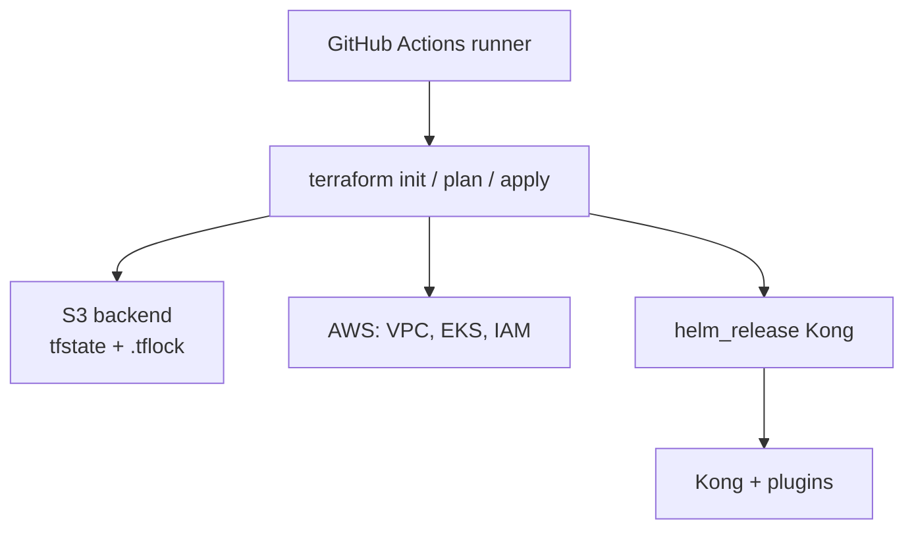
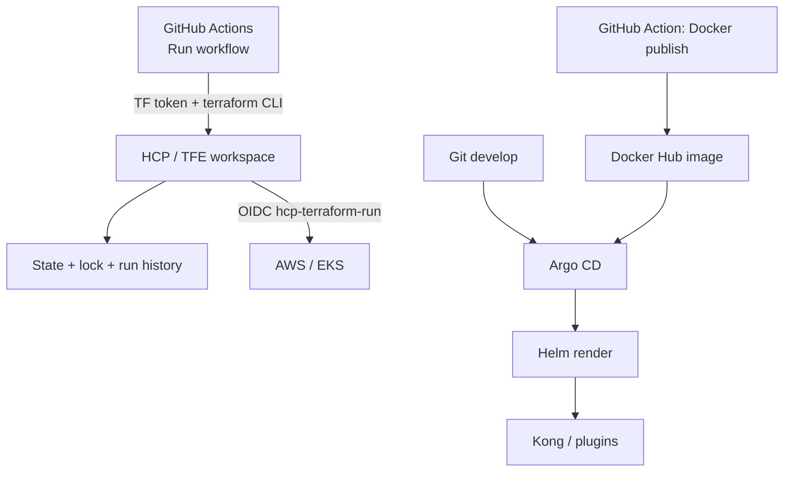
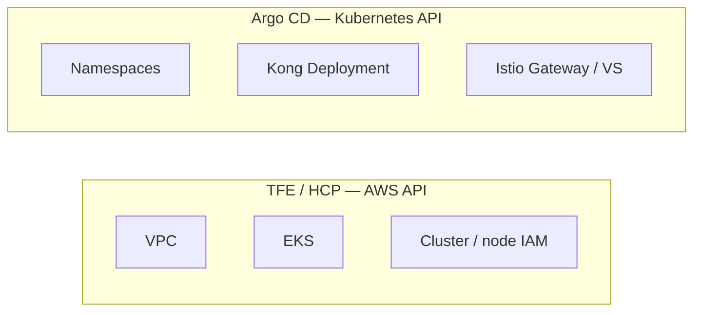

# Architecture decision: GitHub + S3 + Helm vs GitHub → HCP/TFE + Argo CD

This repo already follows **Option 2**. Use this note when explaining *why* to architecture, security, or a team that wants everything in one GitHub Action + S3 + `helm_release`.

**Names:** we run **HCP Terraform** (`app.terraform.io`, org `vaflt-org`), not self-hosted Terraform Enterprise. Same ideas: workspaces, remote state, run queue, lock. Below, **TFE/HCP** means that platform.

Companion: [TERRAFORM-VS-HELM.md](./TERRAFORM-VS-HELM.md) (why Kong is not in Terraform state).

---

## The two architectures

### Option 1 — GitHub Actions runs everything (tightly coupled)



One pipeline, one (or few) state files, Terraform owns AWS **and** Kubernetes.

### Option 2 — split by lifecycle (this repo)



| Layer | Owner in this repo |
| --- | --- |
| Button / checkout | GitHub Actions (`workflow_dispatch`) |
| Terraform **execution**, state, lock | HCP workspace `kong-ai-gateway-aws-workload` |
| Bootstrap IAM / OIDC | HCP workspace `kong-ai-gateway-aws-bootstrap` |
| Kong image | Docker publish Action → Hub |
| Kong / Istio / Argo on the cluster | Helm + Argo CD — **not** Terraform |

GitHub **does** run `terraform plan` / `apply` in the Action. With `cloud {}`, that CLI **starts a remote run**. The runner has **no AWS keys**. AWS is applied on HCP as `hcp-terraform-run`.

---

## Full comparison

| Area | 1. GHA + TF + S3 + Helm | 2. GitHub → TFE/HCP + Argo | Winner |
| --- | --- | --- | --- |
| Terraform execution | GitHub runner | HCP/TFE agents | **2** |
| Terraform state | S3 object + key convention | Workspace state | **2** |
| State locking | S3 `.tflock` (`use_lockfile`) | Run queue + workspace lock | **2** |
| State history | You enable S3 versioning | Versions tied to runs | **2** |
| Backend ops | Bucket, IAM, encryption, keys | Platform | **2** |
| AWS credentials | Runner WIF / keys | HCP OIDC → `hcp-terraform-run` | **2** |
| GitHub privilege | AWS + S3 + often EKS/Helm | Token to talk to HCP | **2** |
| Concurrent apply | You handle retry / stale lock | PENDING behind RUNNING | **2** |
| Accidental apply | Workflow + environments | Workspace + policy + approvals | **2** |
| Audit | GitHub log + AWS CloudTrail | Central HCP run history | **2** |
| K8s ownership | Terraform `helm_release` | Argo | **2** |
| Kong / plugin update | Terraform run | Git + Argo (image tag) | **2** |
| K8s drift | Next `terraform plan` | Continuous OutOfSync | **2** |
| Kong rollback | Git + TF state + Helm release | Git revert, Argo sync | **2** |
| **Initial complexity** | Lower | Higher | **1** |
| **Platforms to operate** | Fewer | GitHub + HCP + Argo | **1** |
| **Cost** | S3 is cheap | HCP/TFE license | **1** |
| **Small team, no HCP** | Often better | Overkill | **1** |
| Large enterprise / existing HCP | DIY operating model | Fit | **2** |

S3 is **not** bad. HashiCorp still supports `backend "s3"` + `use_lockfile` (DynamoDB lock is deprecated). The question is who operates the Terraform **platform**.

---

## What actually changes (frequency)

Design the split around **how often** something moves, not around resource type.

| Change | How often | Tool | Why |
| --- | --- | --- | --- |
| Plugin Lua, `kong.yml`, Dockerfile | Daily / weekly | Docker publish → new image tag → Argo | Not AWS |
| Kong replicas, Service, Istio VS | Weekly | Helm values → Argo | K8s objects |
| Argo CD settings | Rare | Helm `aws/helm/argocd` | Cluster app |
| Node size, EKS version, VPC | Months | HCP Terraform workloads | AWS APIs |
| OIDC / `hcp-terraform-run` | Almost never | HCP Terraform bootstrap | Separate blast radius |
| NLB | With Istio install/uninstall | Helm Istio, **not** `aws_lb` | Drop NLB without destroying EKS |

If Kong and EKS share **one** Terraform state, a plugin bump still evaluates IAM, node groups, and SGs. That is the coupled failure mode.

---

## When tightly coupled (Option 1) is the right call

Use GitHub + Terraform + S3 + even `helm_release` when **most** of this is true:

- 1–2 platform engineers, ~10 stacks, few applies per week
- No HCP/TFE yet, and you will not buy it just to avoid an S3 bucket
- Apps are created once and barely change (or there is no GitOps skill yet)
- One AWS account, one env
- You already standardize GitHub OIDC to AWS

**Tight coupling is OK** when the **same people**, on the **same cadence**, change AWS and the app. Example: a throwaway lab where destroy means “delete the whole demo.”

**Do not** use Option 1 for Kong if plugins ship weekly and EKS ships twice a year. That is this repo.

---

## When to split (Option 2) — this repo

Split when **any** of these is true:

- HCP/TFE already exists (do not invent a second S3 operating model)
- Kong/plugins change much more often than EKS
- You need workspace RBAC, run history, policy, apply approvals
- Manual `kubectl edit` must be visible (Argo OutOfSync), not “next quarter’s TF plan”
- GitHub runners must not hold cluster-admin + state-bucket write

This repo’s states:

| Workspace / system | Lifecycle |
| --- | --- |
| `kong-ai-gateway-aws-bootstrap` | OIDC + run role |
| `kong-ai-gateway-aws-workload` | VPC + EKS + node + budget |
| Helm / Argo (no TF state) | Namespaces, Argo CD, Istio NLB, Kong |

Do **not** split VPC vs subnet vs SG into workspaces. Split by **lifecycle**, not by resource.

---

## State and locking

### Option 1 — you operate S3

```hcl
terraform {
  backend "s3" {
    bucket       = "company-terraform-state"
    key          = "nonprod/eks/terraform.tfstate"
    region       = "us-east-1"
    use_lockfile = true
  }
}
```

You own: bucket, versioning, encryption, IAM, key layout, who can `force-unlock`, GitHub OIDC to that bucket.

Two Actions at once: one holds `.tflock`, the other errors. You wire retries and stale-lock runbooks.

### Option 2 — lock is a run

```text
Run A  RUNNING
Run B  PENDING
Run C  PENDING
```

Workspace lock stops UI, API, and CLI applies. Developers think `kong-ai-gateway-aws-workload`, not `s3://…/eks/terraform.tfstate`.

**TFE/HCP does not fix a giant state.** One workspace that holds EKS + Kong Helm is still one blast radius. Two workspaces (bootstrap vs EKS) plus Argo for apps is the point.

---

## What TFE/HCP is for vs what Argo CD is for



| Question | TFE/HCP | Argo CD |
| --- | --- | --- |
| Does the cluster exist? | Yes | No |
| Are Kong replicas 1 or 2? | No | Yes |
| Who applied the node group? | Run history | — |
| Who shipped plugin `0.1.9`? | — | Git + Application sync |
| NLB from Istio Service | Not in TF state | Helm uninstall drops it |
| `kubectl edit` Kong | Invisible until next apply | OutOfSync / selfHeal |

Argo uses Helm as a **renderer**. Argo owns the live objects. That is why Option 2 is cleaner for Kubernetes than `helm_release` inside Terraform.

---

## Scenarios

| Scenario | Coupled (1) | Split (2) |
| --- | --- | --- |
| Plugin Lua change | TF plan of whole EKS stack | Docker build + Argo (minutes) |
| Bad plugin in prod | TF/Helm rollback + state | Revert git; Argo syncs `v4` |
| Two people apply EKS | S3 lock + failed GHA | HCP queue |
| GitHub runner down mid-apply | State/backend forensics | HCP still owns the run |
| Argo down | N/A | EKS keeps running; no Kong deploys |
| HCP down | N/A | Cluster stays; no EKS applies |
| `kubectl scale` Kong | Drift until next TF | Argo heals if selfHeal on |
| Destroy the lab | One destroy can wipe apps+cluster | Workloads destroy = cluster; bootstrap IAM remains |
| New env `prod` | New S3 key + IAM + workflow | New HCP workspace + Argo project |

---

## Registry and version pinning (hard to migrate later)

Public Registry “latest” vs an **enterprise private registry** is a **dependency** problem, not a state-move problem. State can stay valid. Downgrading CLI/provider/module can still **replace** resources if schemas diverge.

```text
Public:     AWS provider 6.10  +  EKS module 21.0
Enterprise: AWS provider 6.8   +  EKS module 20.37
```

That is not “point `source` at the private registry.” You may need code and **careful plans** so you never see `-/+ aws_eks_cluster`.

Three layers that must stay aligned:

```text
Terraform CLI  →  .tf syntax  →  provider  →  state schema
```

Safer if HCP is the destination from day one:

- Pin CLI to what HCP runs (this workloads stack: `>= 1.5.0`, Actions `1.15.8`)
- Pin providers (`aws ~> 5.0`) and **commit** `.terraform.lock.hcl`
- Avoid `>= 5.0` / “always latest module”
- Promote: public release → review → private registry → teams upgrade

Do not develop on Terraform 1.14 features if HCP only offers 1.12. You cannot assume the older CLI can read state written by the newer one.

This repo uses **public** `hashicorp/aws` today, with a lockfile. Moving to a private registry later is a **source + version** change, not an S3→HCP state copy.

---

## What we would tell security / architecture

> GitHub Actions = trigger and CI (Terraform CLI + Docker build).  
> HCP Terraform = infrastructure execution, state, locking, AWS via OIDC.  
> Terraform = VPC / EKS only.  
> Docker Hub = Kong + plugin artifact.  
> Argo CD + Helm = Kubernetes / Kong.

We did **not** pick Option 2 because S3 state is unreliable. We picked it because Kong’s cadence is not EKS’s, HCP already exists, and GitHub should not hold the cluster and the state bucket.

---

## Scoring (enterprise that already has HCP)

| Category | GHA + S3 + TF Helm | HCP + Argo |
| --- | --- | --- |
| Simplicity / cost | Higher | Lower |
| State, lock, audit, RBAC | Weaker | Stronger |
| K8s GitOps / drift / Kong cadence | Weak | Strong |
| Privilege split | Runner is powerful | Token vs AWS role vs kube |
| Blast radius | Easy to fuse | Workspaces + Argo |

For a two-person lab with no HCP, Option 1 can win. For this Kong AI Gateway platform, Option 2 is the plan we implemented.
