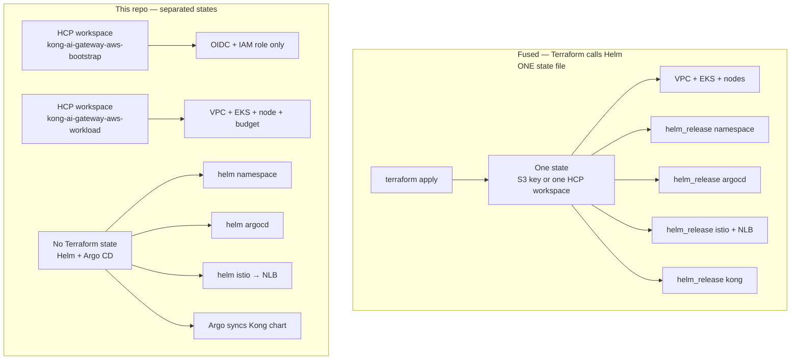

# Terraform vs Helm — why they stay separate

Terraform does **not** call Helm in this repo. Cluster plumbing is Terraform. Apps (Kong, Argo CD, Istio) are Helm / Argo CD. Each Terraform **workspace** has its **own state**. That is the same idea as different S3 keys / folders: delete or destroy one state and the others stay.

GitHub + S3 + `helm_release` vs GitHub → HCP + Argo, locking, what changes often, registry pinning: **[ARCHITECTURE-DECISION.md](./ARCHITECTURE-DECISION.md)**.



---

## Why not `helm_release` inside Terraform

| | Terraform calls Helm (one stack) | This approach |
| --- | --- | --- |
| Who owns Kong replicas / image tag | Terraform state | Git + Argo CD |
| `terraform destroy` | **Wipes cluster and every app** | Workloads destroy = cluster only. Helm apps are already gone with the cluster, but **bootstrap IAM stays**. You can also uninstall Istio/Kong **without** touching EKS. |
| Change `replicaCount` | New Terraform plan/apply, lock the whole stack | Push `values.yaml`, Argo syncs in ~1 min |
| State lock | One lock — EKS apply blocks Kong apply | Bootstrap, workloads, Helm do not share a lock |
| Drift | Helm and Terraform both try to own the same objects | Terraform = AWS APIs. Helm = Kubernetes API |

Terraform is good at VPC, IAM, EKS. It is a poor GitOps engine for app YAML.

---

## Why different folders / different state (S3 or HCP)

Think of **one state file** as **one blast radius**. Remote state (HCP workspace, or `s3://bucket/env/app/terraform.tfstate`) is just “where that file lives.”

| State (this repo) | Folder | If you delete / destroy **this** state |
| --- | --- | --- |
| **Bootstrap** | `aws/terraform/bootstrap` | OIDC + `hcp-terraform-run` role gone. Workloads cannot apply via HCP until you recreate it. **EKS and Kong keep running.** |
| **Workloads** | `aws/terraform/workloads/dev` | VPC, EKS, node, budget gone. Cluster dead. **Bootstrap IAM remains.** Helm releases disappear with the API, but their **git** is untouched. |
| **Helm / Argo** (not TF state) | `aws/helm/*`, `aws/argocd/*` | `helm uninstall` / Argo delete removes apps or the NLB. **EKS and bootstrap stay.** |

Same idea if you used S3 instead of HCP:

```text
s3://tfstate-bucket/
  bootstrap/terraform.tfstate      ← do not mix
  workloads/dev/terraform.tfstate
  # no helm.tfstate — apps are not Terraform
```

---

## If you fused the same state file — what is in it, and what goes wrong

One apply / one destroy would track **all** of this together:

- VPC, subnets, IGW, routes  
- EKS cluster + node group + launch template  
- Cluster IAM + node IAM  
- Budget  
- Bootstrap OIDC (if you merged that too)  
- `helm_release` namespaces  
- `helm_release` Argo CD  
- `helm_release` Istio (and the **NLB**)  
- `helm_release` Kong (image tag, replicas, plugins-via-image)

Problems:

1. **`terraform destroy` = everything.** You cannot “just drop Istio/NLB” without a careful target destroy. One bad apply can take EKS with it.  
2. **One lock.** A 15-minute EKS node change blocks a 10-second replica bump.  
3. **Two owners of the same object.** Argo CD and Terraform both want `Deployment` replicas. Self-heal vs `terraform apply` fight.  
4. **App cadence ≠ infra cadence.** Plugin/image tags change daily. EKS should not.  
5. **State size and blast radius.** One corrupted or deleted state file loses the map of **the whole platform**.  
6. **Secrets and Helm.** License, Argo password, Hub tokens get pulled into Terraform state.  
7. **NLB lifecycle.** The NLB belongs to the Istio Service. Helm uninstall should delete it. Terraform would also try to manage `aws_lb` or the Helm release — double management.  
8. **Environments.** `dev` vs `prod` need **separate** state keys. One file for both is how you destroy prod by applying dev.

---

## What we actually do

```text
Bootstrap state  →  IAM so HCP can talk to AWS
Workloads state  →  VPC + EKS only
Helm / Argo      →  namespaces, Argo CD, Istio+NLB, Kong image
```

Uninstall Istio (`./aws/helm/istio/uninstall.sh`) stops the NLB charge and does **not** run Terraform. `enabled=false` on workloads destroys the cluster and does **not** delete the bootstrap workspace.

---

## Questions people ask

**Why doesn’t Terraform install Kong / Istio / Argo?**  
Those are Kubernetes objects. Helm and Argo CD already own them. Terraform would only wrap `helm install` and then fight GitOps on every replica or image change.

**Why two Terraform workspaces instead of one?**  
Bootstrap is “can HCP talk to AWS?” Workloads is “does the cluster exist?” Different lifetime, different blast radius. Same reason you would use two S3 keys, not one `terraform.tfstate`.

**What is a state file, in one sentence?**  
Terraform’s memory of what it created. Delete or corrupt that file and Terraform no longer knows those resources exist — or a destroy will try to delete everything listed in it.

**If I delete the bootstrap state / workspace, does EKS die?**  
No. The cluster keeps running. HCP just cannot assume the IAM role until you recreate bootstrap.

**If I delete the workloads state / workspace, does IAM die?**  
No. VPC and EKS are gone (or orphaned if you only deleted the file and never destroyed). Bootstrap OIDC + `hcp-terraform-run` stay.

**If I `helm uninstall` Istio, does Terraform notice?**  
No. The NLB was never in Terraform state. That is the point. Uninstall Istio to drop the NLB bill without an HCP apply.

**If I destroy EKS, do I need to uninstall Helm first?**  
The API and all Helm releases vanish with the cluster. Uninstall Istio first only if you want the NLB gone *before* the node dies, or if something is stuck on the AWS side.

**Why not put Helm in Terraform but keep a second state just for Helm?**  
You still lose GitOps: image tags and replicas become `terraform apply`. Argo CD would still fight that second state. Extra workspace, same ownership problem.

**Why not one S3 bucket with one key for everything?**  
The bucket can be shared. The **key / folder / workspace** must not be. One key = one blast radius. Fuse bootstrap + EKS + Helm and one destroy or one deleted object is the whole platform.

**What would be in that fused state if we had used it?**  
VPC, subnets, IGW, EKS, node group, cluster/node IAM, budget, OIDC (if merged), every `helm_release` (namespaces, Argo, Istio+NLB, Kong). Destroy or lose that file and all of those are at risk.

**Who owns the NLB?**  
The Istio `istio-ingressgateway` Service (`type: LoadBalancer`). Kubernetes / AWS LB controller create it. Not `aws_lb` in Terraform.

**Who owns namespaces?**  
The `aws/helm/namespace` chart. Not `kubernetes_namespace` in Terraform. So you can recreate `argocd` / `kong-ai-gateway` without an EKS apply.

**Who changes Kong replicas or the image tag?**  
Git (`values.yaml`) → Argo CD. Not Terraform. Docker publish already bumps `image.tag` and commits it.

**Will Argo and Terraform fight?**  
Not if they do not manage the same objects. Terraform = AWS (VPC/EKS). Argo = Kong chart in-cluster. Do not add `helm_release` for Kong on top of the Application.

**One lock — what does that mean?**  
Remote state is locked during apply. If EKS and Kong share state, a 15-minute node change blocks a 10-second replica bump (and the other way around).

**Why is bootstrap so small?**  
It only has to exist so HCP / GitHub OIDC can apply workloads. You almost never destroy it. Keeping it out of the EKS state means “tear down the lab” does not delete the role you need to build the lab again.

**Can I still `terraform apply` workloads after apps are installed?**  
Yes. Workloads should only plan VPC/EKS/budget. If a plan starts wanting Helm or the NLB, something was added to the wrong folder.

**What if two people apply the same workspace at once?**  
State lock: one wins, the other waits or errors. That is another reason not to put daily app deploys on that lock.

**Dev vs prod — same state?**  
Never. Separate workspaces or S3 keys (`workloads/dev`, `workloads/prod`). One file for both is how you destroy prod by applying dev.

**Does a second HCP workspace cost extra?**  
HCP bills workspaces/runs, not “number of AWS resources in state.” Two small workspaces are cheaper in *risk* than one giant apply. Helm is free of that bill.

**Where does the kubeconfig / access entry live?**  
Cluster access is AWS IAM + EKS access entries, not Helm. If it is not in workloads Terraform yet, it is still CLI — do not stuff it into a Helm chart.

**State has secrets — is that why Helm stays out?**  
Partly. `helm_release` stores values (passwords, license) in Terraform state. Argo / Kubernetes secrets stay on the cluster (and in your secret manager), not in the EKS state file.

**We already use Terraform everywhere. Is this “wrong”?**  
No. Terraform for AWS, Helm/Argo for apps is a common split. `helm_release` is fine for a one-off lab with no GitOps. This repo chose Argo, so Terraform stops at the cluster.

**How do I add another app (Grafana, a second gateway)?**  
New Helm chart or Argo Application. Do not add it to `aws/terraform/workloads`. Do not create a third Terraform state for that app unless it is AWS (RDS, IAM, Route53).

**What if I only have S3, not HCP?**  
Same split:

```text
s3://your-bucket/
  bootstrap/terraform.tfstate
  workloads/dev/terraform.tfstate
```

Different keys. Never `terraform.tfstate` at the bucket root for the whole repo.

**What should I say in a review / interview?**  
“We split state by blast radius and by API. IAM bootstrap, then VPC/EKS, then Kubernetes apps. Terraform does not call Helm so destroy, lock, and GitOps stay on the right tool.”
