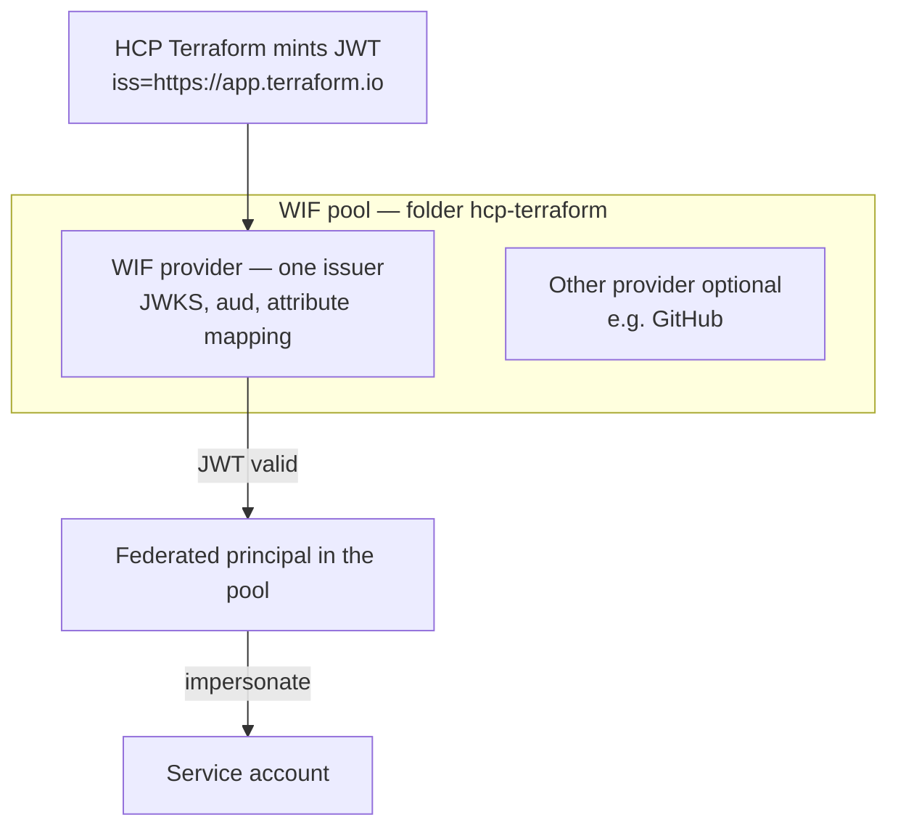
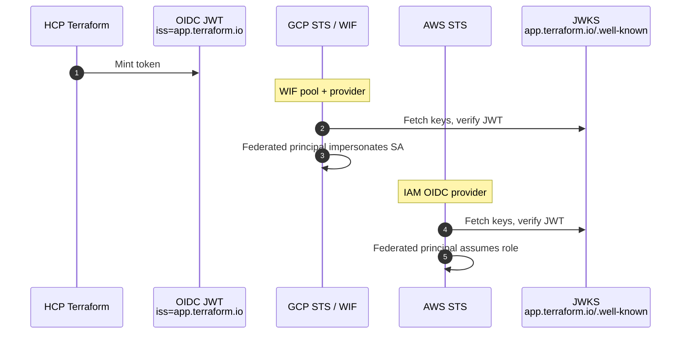
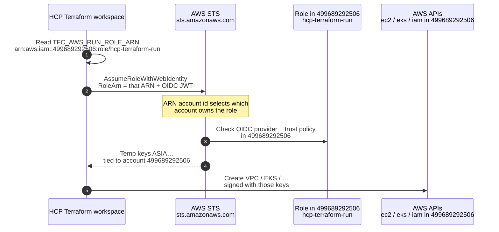
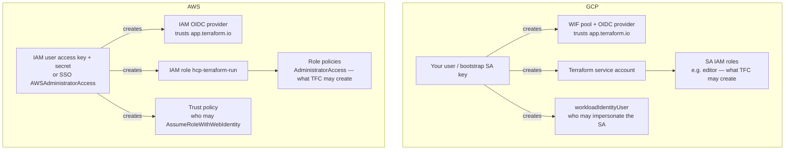
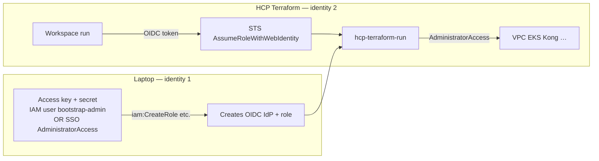

# GCP service account + WIF vs AWS access key + OIDC role

How this repo’s AWS bootstrap maps to the GCP pattern (service account + Workload Identity Federation) used with [HCP Terraform](https://app.terraform.io/).

Connection flow: [how-terraform-connects-to-aws.md](./how-terraform-connects-to-aws.md).

---

## Two identities — they are not the same

The access key does **not** assume `hcp-terraform-run` during bootstrap. That key *is* an IAM user. Terraform talks to IAM **as that user** and **creates** the role. Later, HCP Terraform **assumes** the role with an OIDC token. That assume-role step is WIF.

**Impersonate = AssumeRole.** In GCP, Terraform Cloud never “logs in as” a user; it **impersonates a service account**. In AWS, it never uses your IAM user; it **assumes a role** (`AssumeRoleWithWebIdentity`). Same pattern: a short-lived identity of the workload SA/role, not of you.

| GCP | AWS |
| --- | --- |
| Impersonate service account | Assume IAM role |
| `generateAccessToken` / WIF federated token on the SA | `sts:AssumeRoleWithWebIdentity` on `hcp-terraform-run` |
| You still exist as a user; TFC does not become you | You still exist as an IAM user; TFC does not become your access key |

---

## What is a WIF pool vs a WIF provider

GCP splits federation into two objects. AWS folds them into one IAM OIDC provider.

### WIF pool = folder

A **workload identity pool** is a namespace for identities that are **not** Google users or service accounts. It does not trust any issuer by itself. It has an ID such as `hcp-terraform`.

Federated principals look like:

```text
principalSet://iam.googleapis.com/projects/PROJECT_NUMBER/locations/global/workloadIdentityPools/hcp-terraform/*
```

That path is how you grant `roles/iam.workloadIdentityUser` on the SA: “anyone in this pool (matching attributes) may impersonate this SA.”

One pool can hold several providers (HCP Terraform, GitHub Actions, AWS, Azure).

### WIF provider = one trusted issuer (JWT + JWKS)

A **workload identity provider** lives **inside** a pool. It is the actual trust:

| Setting | Meaning |
| --- | --- |
| Issuer URL | `https://app.terraform.io` — where the JWT `iss` must come from |
| JWKS | GCP fetches `iss` + `/.well-known/openid-configuration` then JWKS, and verifies the signature |
| Audiences | JWT `aud` must match (e.g. GCP workload identity audience) |
| Attribute mapping | `google.subject` ← `assertion.sub`, extra attrs from org/workspace |
| Attribute condition | Optional CEL: only this TFC org/workspace |

HCP Terraform mints a JWT → GCP looks up the provider by issuer → validates JWKS → maps claims into the **pool** → that pool principal impersonates the SA.



### AWS has no separate pool

| GCP | AWS |
| --- | --- |
| Pool (folder) | The AWS **account** is the container |
| Provider (issuer + JWKS) | `aws_iam_openid_connect_provider` `url=https://app.terraform.io` |
| Attribute mapping / condition | Role trust-policy `Condition` on `aud` and `sub` |
| Impersonate SA | `AssumeRoleWithWebIdentity` on `hcp-terraform-run` |

So: **pool = where external identities live; provider = how one IdP is verified.** The IAM role is not a pool and not a provider; it is the SA you become after the provider accepts the JWT.

### Provider URL vs “which account we deploy to”

**Provider (correct):** you put the Terraform issuer URL.

| | GCP WIF provider | AWS IAM OIDC provider (`aws_oidc.tf`) |
| --- | --- | --- |
| Issuer URL | `https://app.terraform.io` or your **TFE hostname** | `https://${var.tfc_hostname}` default `app.terraform.io` |
| What it means | Trust JWTs from that host; fetch JWKS there | Same |

That URL is **who issues the token**, not where AWS/GCP resources are created.

**Pool is not the deploy account (correct this):**

| | What people think | What it actually is |
| --- | --- | --- |
| GCP WIF **pool** | “The GCP project we deploy into” | Only a **name/folder** for external identities, created *inside* some GCP project |
| Where GCP **workloads** land | — | The **service account’s** project + the IAM roles on that SA |
| AWS “pool” | “The AWS account we deploy into” | There is no pool. The **OIDC provider is created in an account** (here `499689292506`) |
| Where AWS **workloads** land | — | The **IAM role’s** account + policies on `hcp-terraform-run` |

```text
Provider  = TFE/HCP URL          →  who is the IdP (JWT issuer)
Pool      = identity folder      →  NOT the deploy target
Role / SA = what TFC becomes     →  THIS decides where you can create VPC/EKS
```

This repo: bootstrap apply with creds for **VAFLT-DEV-ENV** (`499689292506`) creates the OIDC provider **and** the role **in that same account**. TFC then assumes that role, so it deploys **in 499689292506**. If the role lived in another account, TFC would deploy there instead — not because of a pool id.

---

## WIF pool + JWKS vs IAM OIDC provider (role is not enough)

On GCP, Terraform does not send a Google password. It sends an **OIDC JWT** from `app.terraform.io`. GCP downloads **JWKS** from that issuer and validates the signature. The **WIF pool + provider** is the identity container that trusts that issuer. Only after that does GCP let that federated identity **impersonate the SA**.

AWS is the same JWT/JWKS flow. The role is only “what you become.” The **identity** that AWS trusts is the **IAM OIDC provider**, not an IAM user.

| GCP | AWS | Job |
| --- | --- | --- |
| WIF **pool** | (no separate pool object) | Folder for external identities |
| WIF **provider** (issuer URL, audiences) | **IAM OIDC identity provider** `url=https://app.terraform.io` | Trust issuer; AWS fetches JWKS from that URL |
| Attribute mapping (`google.subject` ← `sub`) | Trust-policy `Condition` on `sub` / `aud` | Bind token claims |
| Impersonate SA | `AssumeRoleWithWebIdentity` | Become the workload identity |
| Service account | IAM **role** `hcp-terraform-run` | Permissions to create infra |

**A role alone is not enough.** Without the OIDC provider, AWS has no JWKS trust for `app.terraform.io`, so TFC cannot assume anything.



### “Usually a user assumes a role” — not this path

Normal IAM:

```text
IAM user  →  sts:AssumeRole  →  role
```

Trust policy `Principal` is that **user** (or an AWS account). The user is a first-party AWS identity.

HCP Terraform:

```text
TFC JWT  →  sts:AssumeRoleWithWebIdentity  →  role
```

Trust policy `Principal` is **Federated** = `arn:aws:iam::ACCOUNT:oidc-provider/app.terraform.io`. There is **no IAM user** for TFC. You do **not** attach this role to a user. “Who may assume” is written **on the role** (`assume_role_policy`), matching `aud` + `sub`.

This repo’s code creates both pieces in `aws_oidc.tf`:

1. `aws_iam_openid_connect_provider.tfc` — WIF provider (identity)
2. `aws_iam_role.tfc_run` + trust policy — SA + impersonation binding

### How Terraform reaches a specific AWS account

There is no `aws_account_id` variable like a GCP project id on the provider. The **account is inside the role ARN**. GCP is the same idea: the project is inside the SA email (`sa@PROJECT.iam.gserviceaccount.com`).

How it looks after bootstrap in `499689292506`:

```text
TFC_AWS_RUN_ROLE_ARN =
  arn:aws:iam::499689292506:role/hcp-terraform-run
              │            │    │
              │            │    └─ role name (the SA)
              │            └────── resource type
              └─────────────────── AWS account = deploy target
```

OIDC provider in the same account:

```text
arn:aws:iam::499689292506:oidc-provider/app.terraform.io
```

How a run hits that account:



1. Workspace has `TFC_AWS_RUN_ROLE_ARN` (set by `tfc.tf`).
2. TFC calls STS with **that full ARN**. STS looks up the role in account **499689292506**.
3. That account must already have the OIDC provider (JWKS trust) and the role trust policy.
4. STS returns credentials whose identity is `arn:aws:sts::499689292506:assumed-role/hcp-terraform-run/...`.
5. Every following AWS API call is in **that** account.

`AWS_REGION` only picks the region (e.g. `us-east-1`) **inside** that account. It does not pick the account.

To deploy a different account later: create OIDC + role **in that account**, put **that** account’s role ARN on the workspace (or a second workspace). TFC follows the ARN.

---
| | GCP | AWS here |
| --- | --- | --- |
| **You / bootstrap** | Your Google user (ADC) or a bootstrap SA JSON key | IAM user **access key + secret**, or Identity Center `AWSAdministratorAccess` |
| **What HCP Terraform becomes** | Workload SA + WIF (no JSON key in TFC) | IAM role `hcp-terraform-run` + OIDC (no `AKIA` key in TFC) |
| **Service account** | Terraform service account | IAM role `hcp-terraform-run` |
| **WIF / federation** | WIF pool + OIDC provider | IAM OIDC provider `https://app.terraform.io` |
| **Who may impersonate** | `roles/iam.workloadIdentityUser` on the SA | Role **trust policy** `sts:AssumeRoleWithWebIdentity` + `aud` / `sub` |
| **What TFC may create** | IAM roles on the SA (e.g. editor) | Policies **on the role** (`AdministratorAccess` today) |
| **TFC env var for identity** | `TFC_GCP_RUN_SERVICE_ACCOUNT_EMAIL` | `TFC_AWS_RUN_ROLE_ARN` |
| **TFC env var to enable federation** | `TFC_GCP_PROVIDER_AUTH=true` | `TFC_AWS_PROVIDER_AUTH=true` |
| **Static key (avoid in TFC)** | SA JSON key | IAM access key (`AKIA…`) |



---

## Identity 1 — access key / SSO user (bootstrap only)

This principal **does not assume** `hcp-terraform-run`. It needs permission to **create IAM trust objects**.

- Identity Center: permission set `AWSAdministratorAccess` is enough.
- IAM user key (`AKIA…`): that **user** needs IAM admin (`AdministratorAccess` on `bootstrap-admin`).

What this local apply creates (IAM):

| AWS permission | Creates |
| --- | --- |
| `iam:CreateOpenIDConnectProvider` | OIDC provider for `app.terraform.io` (WIF provider) |
| `iam:CreateRole` | Role `hcp-terraform-run` (the SA) |
| `iam:UpdateAssumeRolePolicy` | Trust policy (who may impersonate) |
| `iam:AttachRolePolicy` | Attach `AdministratorAccess` to the run role |
| `iam:GetRole`, `iam:List*`, `iam:TagRole`, … | Read/update during apply |

The key does **not** create VPC/EKS on this apply. `AdministratorAccess` on the user *could*, but `bootstrap/` Terraform does not.

---

## Identity 2 — role `hcp-terraform-run` (HCP Terraform = GCP SA)

HCP Terraform never uses your access key. It sends an OIDC token; STS returns temporary `ASIA…` keys **for this role**.

| GCP | AWS |
| --- | --- |
| WIF provider trusts TFC issuer | OIDC provider `https://app.terraform.io` |
| `roles/iam.workloadIdentityUser` | Trust policy `AssumeRoleWithWebIdentity` + `aud` + `sub` |
| SA email | Role ARN |
| Roles on the SA | Policies on the role |

What **this role** can create later: anything `AdministratorAccess` allows — VPC, EKS, IAM, Kong, and so on. Scope that policy down after the platform exists.



---

## Do not put the key in HCP Terraform

That would be storing a GCP SA JSON key as a workspace variable instead of WIF.

| Do | Don't |
| --- | --- |
| Laptop uses key/SSO to create OIDC + role | Put `AWS_ACCESS_KEY_ID` on the TFC workspace |
| TFC uses `TFC_AWS_RUN_ROLE_ARN` + OIDC | Use root access keys |
| Workload runs get `ASIA…` STS keys | Reuse bootstrap `AKIA…` keys in TFC |

**Short version:** the key’s user is the bootstrap admin (creates WIF + SA). The role is the workload identity (TFC impersonates it).
