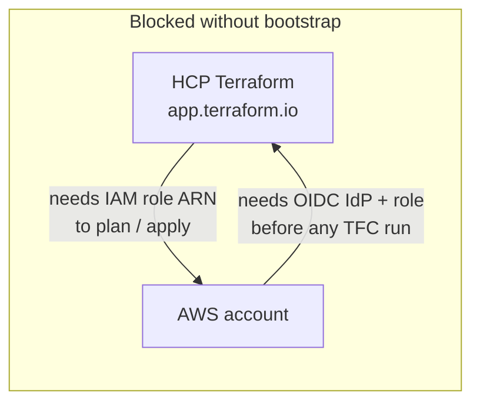
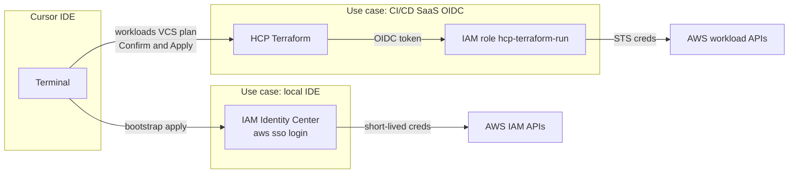
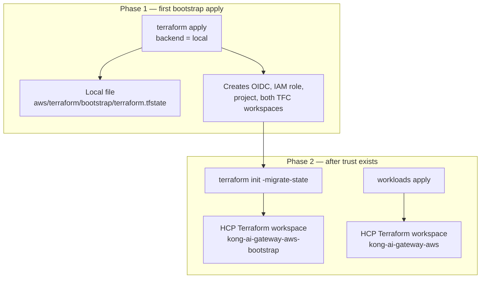
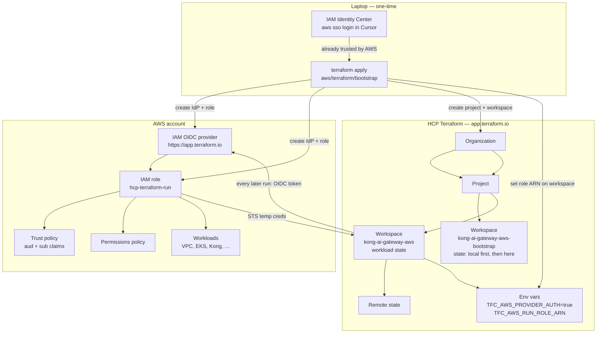
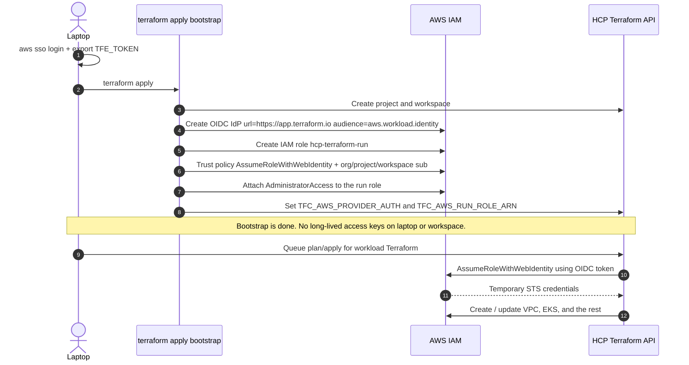
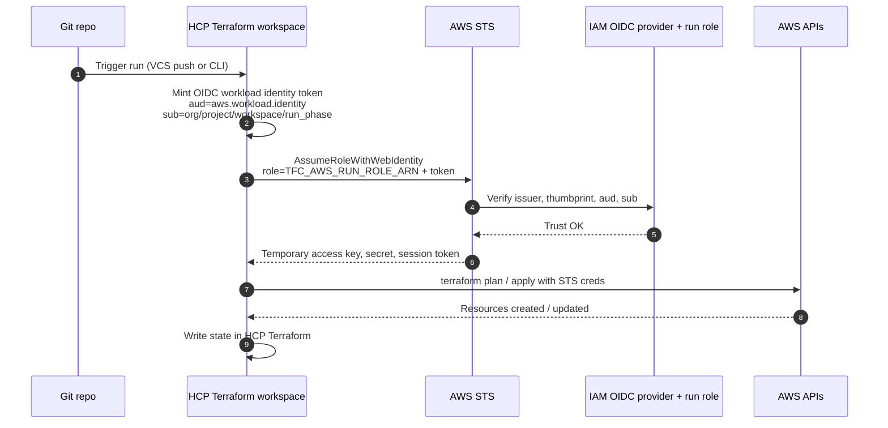

# HCP Terraform on AWS — bootstrap and integration

How to connect this repo to [HCP Terraform](https://app.terraform.io/) so runs can deploy AWS infrastructure. Initial setup is **Terraform**, not the AWS or HCP consoles.

HCP Terraform stores **state, plans, and run history**. It does **not** start with permission to call AWS APIs. That permission is an IAM role in *your* account. The stack in `bootstrap/` creates that role and wires the workspace.

Official setup: [Dynamic credentials with the AWS provider](https://developer.hashicorp.com/terraform/cloud-docs/dynamic-provider-credentials/aws-configuration). Example this follows: [hashicorp/terraform-dynamic-credentials-setup-examples/aws](https://github.com/hashicorp/terraform-dynamic-credentials-setup-examples/tree/main/aws).

---

## The chicken-egg problem

HCP Terraform cannot create AWS resources until AWS trusts HCP Terraform. AWS cannot be taught that trust *by* HCP Terraform, because there is not yet a role for HCP Terraform to assume.



**What you do first:** apply `aws/terraform/bootstrap` **locally** with credentials that already have IAM admin rights. After that, HCP Terraform owns day-2 infrastructure.

---

## Code-first bootstrap

`bootstrap/` is a local Terraform root module. One `terraform apply` creates:

| Object | Created by |
| --- | --- |
| IAM OIDC identity provider (`https://app.terraform.io`) | `aws_oidc.tf` |
| IAM run role + trust policy (org/project/workspace `sub`) | `aws_oidc.tf` |
| Managed policy attachments on that role | `aws_oidc.tf` |
| HCP Terraform project + workspace | `tfc.tf` |
| Workspace env vars `TFC_AWS_PROVIDER_AUTH`, `TFC_AWS_RUN_ROLE_ARN`, `AWS_REGION` | `tfc.tf` |

Do **not** create long-lived `AWS_ACCESS_KEY_ID` / `AWS_SECRET_ACCESS_KEY` for root, an IAM user, or the HCP Terraform workspace.

### Access-key alternatives — use cases selected

AWS documents [alternatives to long-term access keys](https://docs.aws.amazon.com/IAM/latest/UserGuide/security-creds-programmatic-access.html) and five common replacements in [Beyond IAM access keys](https://aws.amazon.com/blogs/security/beyond-iam-access-keys-modern-authentication-approaches-for-aws/). This repo uses **two** of them because there are two callers. It does **not** use IAM user or root access keys.

| Who | AWS use case | What we use | Why |
| --- | --- | --- | --- |
| You in Cursor | **Local development / IDE** | [IAM Identity Center](https://docs.aws.amazon.com/cli/latest/userguide/cli-configure-sso.html) + `aws sso login` in the IDE terminal | Human on a laptop. Temporary SSO creds, MFA, no static keys in the project. |
| HCP Terraform runs | **External CI/CD SaaS (OIDC)** | IAM OIDC provider + run role | Machine identity outside AWS. Short-lived STS creds per plan/apply. |

Not selected:

| AWS alternative | Why not |
| --- | --- |
| Long-term IAM / root access keys | Permanent secret in the IDE, env, or git. Root keys are an account-takeover risk. |
| CloudShell | Browser CLI, not this IDE. |
| IAM role on EC2/ECS/Lambda | Nothing is running inside AWS yet. |
| IAM Roles Anywhere | For servers/certs off AWS, not an IDE. |

Deploy flow: bootstrap first apply can run in the Cursor terminal (SSO). After that, both workspaces are **Version control** — a push to `develop` plans in HCP; Confirm & Apply there. HCP assumes `hcp-terraform-run` over OIDC.



### Credentials on the laptop

1. **AWS IAM Identity Center** — enable it once in the account (root console, then stop using root). Create a user and an Administrator permission set. In Cursor:

   ```bash
   aws configure sso
   # SSO start URL, region, account, AdministratorAccess
   # profile name: kong-ai-gateway-admin
   aws sso login --profile kong-ai-gateway-admin
   aws sts get-caller-identity --profile kong-ai-gateway-admin
   ```

   Put that profile name in `aws_profile` in `terraform.tfvars`.

2. **HCP Terraform** — user API token in `TFE_TOKEN`. Sign up once at [app.terraform.io](https://app.terraform.io/), then User Settings → Tokens. If the organization does not exist yet, set `create_tfc_organization = true` and `tfc_organization_email`.

### Apply from Cursor

```bash
cd aws/terraform/bootstrap
cp terraform.tfvars.example terraform.tfvars
# set tfc_organization_name and aws_profile

aws sso login --profile kong-ai-gateway-admin
export TFE_TOKEN="..."

terraform init
terraform plan
terraform apply
```

`terraform.tfvars` and `terraform.tfstate` are gitignored. Keep the local state file private until you migrate it.

After apply, later infrastructure goes in `aws/terraform/workloads`. You still type `terraform apply` in Cursor; the run executes on HCP Terraform with OIDC. Re-apply `bootstrap/` only when trust or workspace settings change.

---

## State: local first, HCP Terraform later

Yes. Bootstrap cannot use [app.terraform.io](https://app.terraform.io/) as its backend on the first apply — that workspace and the AWS trust do not exist yet. Workload state never uses local.

| Stack | First apply | Later |
| --- | --- | --- |
| `bootstrap/` | **Local** `terraform.tfstate` | Migrate to workspace `kong-ai-gateway-aws-bootstrap` |
| `workloads/` | **HCP Terraform** from the start | Stays on workspace `kong-ai-gateway-aws` |



### Phase 2 — move bootstrap state to app.terraform.io

Do this only after the first local apply succeeded.

1. In `versions.tf`, replace the `backend "local"` block with the `cloud` block from `backend.cloud.tf.example`. Set `organization` to your org name.
2. From `aws/terraform/bootstrap`:

```bash
terraform init -migrate-state
```

Confirm the copy. Terraform uploads the local state into workspace `kong-ai-gateway-aws-bootstrap`. After that, delete or archive the local `terraform.tfstate` so you do not apply against two backends.

---

## Choose your workflow (HCP workspace settings)

When HCP asks **Choose your workflow**, pick **Version control** for both workspaces. Same GitHub repo and branch; different working directories so they do not steal each other's runs.

| Workspace | Choose | Working directory | Trigger prefixes |
| --- | --- | --- | --- |
| `kong-ai-gateway-aws-bootstrap` | **Version control workflow** | `aws/terraform/bootstrap` | `aws/terraform/bootstrap` |
| `kong-ai-gateway-aws-workload` | **Version control workflow** | `aws/terraform/workloads/dev` | `aws/terraform/workloads` |

### Shared VCS settings

HCP clones GitHub and posts a **plan on the workspace** when matching files change. Confirm & Apply in HCP (auto-apply off).

- Provider: GitHub
- Repository: `UttamGiri/kong-ai-gateway`
- VCS branch: `develop`
- Auto-apply: off (plan, then Confirm)

CLI-driven workspaces do not show those VCS plans. Do not switch workloads back to CLI.

---

## What bootstrap creates

| Object | Purpose |
| --- | --- |
| IAM OIDC identity provider | Trusts issuer `https://app.terraform.io`, audience `aws.workload.identity` |
| IAM run role (`hcp-terraform-run`) | Identity HCP Terraform assumes for plan/apply (short-lived STS creds) |
| Trust policy on that role | `sts:AssumeRoleWithWebIdentity`, locked to your org / project / workspace |
| Permissions on that role | Default `AdministratorAccess`. Scope this down after workloads exist. |

---

## End-to-end architecture



---

## Bootstrap sequence



Trust `sub` claim used by the role:

```text
organization:ORG_NAME:project:PROJECT_NAME:workspace:WORKSPACE_NAME:run_phase:*
```

---

## Runtime: how a run authenticates

After bootstrap, every plan and apply gets fresh credentials. Nothing long-lived is stored in HCP Terraform.



---

## Layout

```text
aws/terraform/
  hcp-terraform-aws-bootstrap.md
  bootstrap/          first apply: local state; later migrate to TFC bootstrap workspace
  bootstrap/backend.cloud.tf.example
  workloads/          HCP Terraform workspace from the first apply
```

---

## Trust policy shape

Created in code by `aws_oidc.tf`. One statement per workspace (bootstrap and workloads):

```json
{
  "Version": "2012-10-17",
  "Statement": [
    {
      "Effect": "Allow",
      "Principal": {
        "Federated": "arn:aws:iam::ACCOUNT_ID:oidc-provider/app.terraform.io"
      },
      "Action": "sts:AssumeRoleWithWebIdentity",
      "Condition": {
        "StringEquals": {
          "app.terraform.io:aud": "aws.workload.identity"
        },
        "StringLike": {
          "app.terraform.io:sub": "organization:ORG_NAME:project:PROJECT_NAME:workspace:kong-ai-gateway-aws-bootstrap:run_phase:*"
        }
      }
    }
  ]
}
```

A second identical statement is created for workspace `kong-ai-gateway-aws`. Lock `sub` as tightly as you can. At minimum lock the organization name so other HCP Terraform orgs cannot assume the role.
