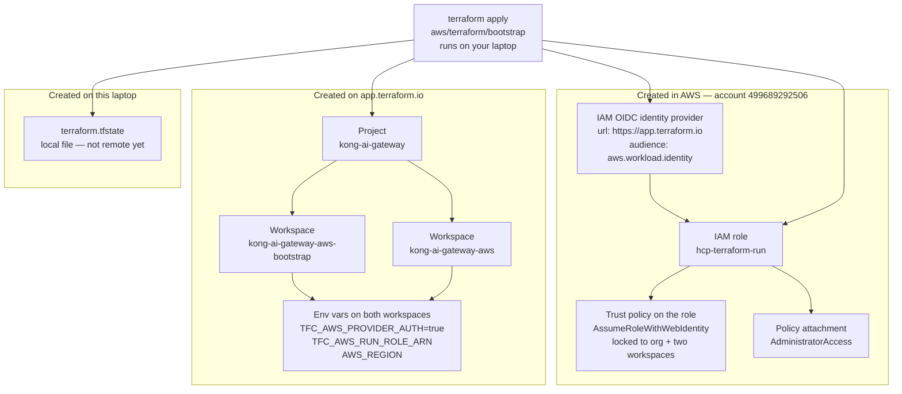
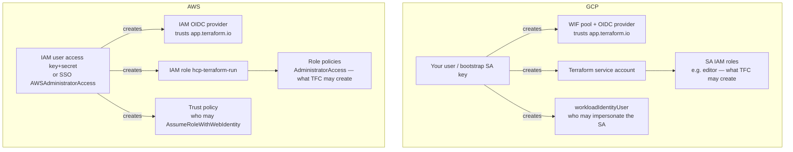
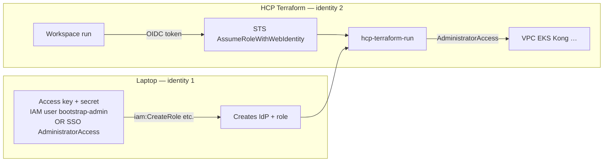
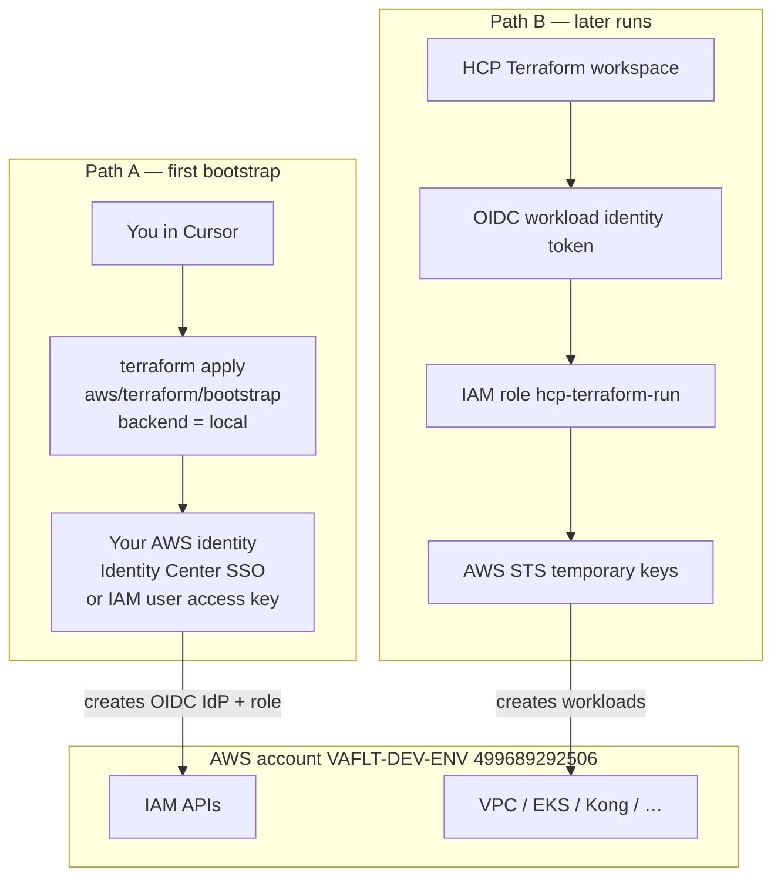
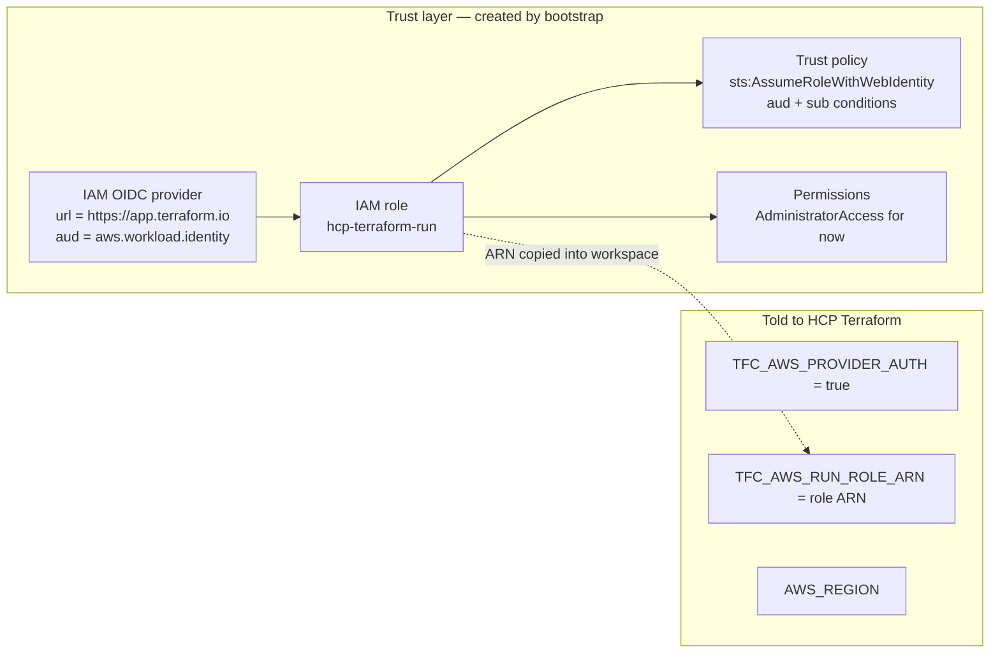
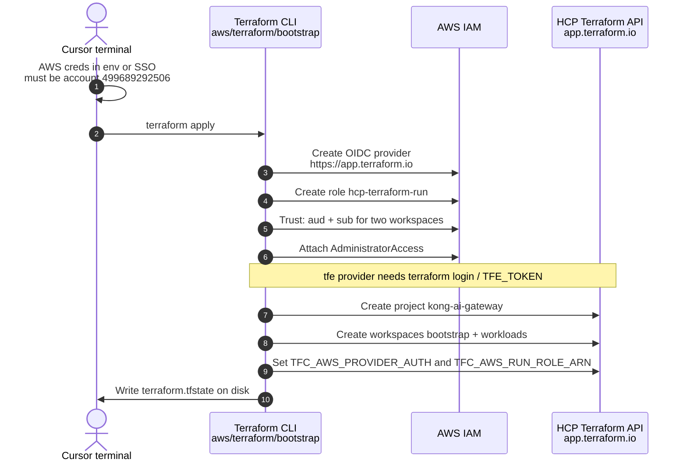
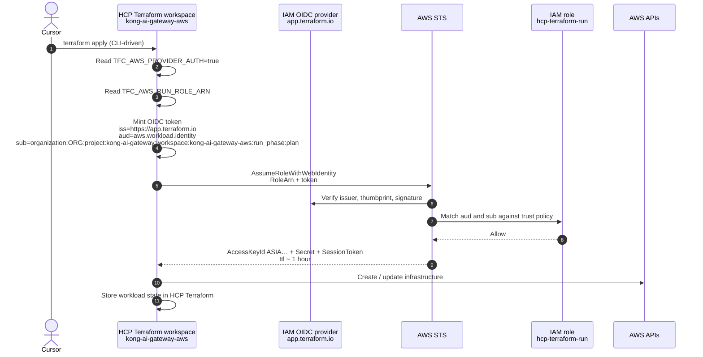
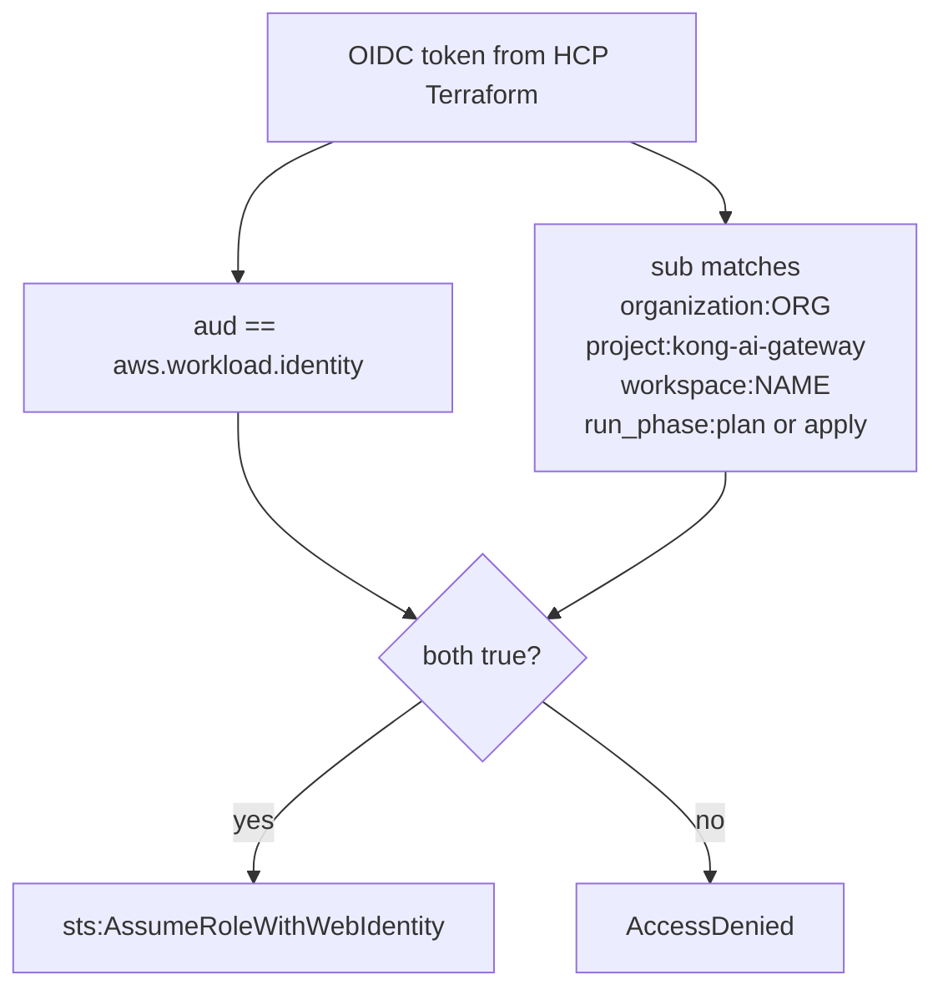
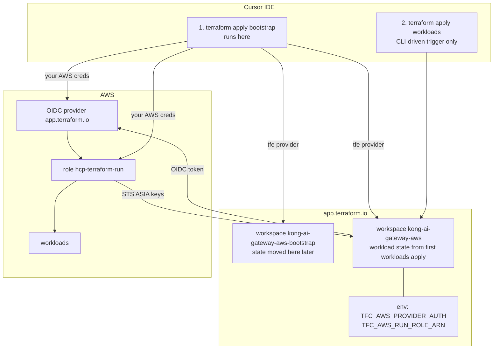

# How Terraform connects to AWS

This file is the connection model only: who authenticates, what AWS trusts, and how credentials are minted. Operator steps live in [hcp-terraform-aws-bootstrap.md](./hcp-terraform-aws-bootstrap.md). Official AWS OIDC docs: [Dynamic credentials with the AWS provider](https://developer.hashicorp.com/terraform/cloud-docs/dynamic-provider-credentials/aws-configuration).

There are **two Terraform-to-AWS paths**. They never share the same credentials.

| Path | Who runs Terraform | How AWS is authenticated |
| --- | --- | --- |
| Bootstrap (first apply) | Your laptop (Cursor) | Your IAM Identity Center session or IAM user keys |
| Workloads (every later run) | [HCP Terraform](https://app.terraform.io/) workers | OIDC → IAM role `hcp-terraform-run` → STS |

---

## What `aws/terraform/bootstrap` creates

One local `terraform apply` creates **trust objects only**. It does not create VPC, EKS, Helm, or Kong.



### AWS

| Resource | Default name | File |
| --- | --- | --- |
| OIDC provider | issuer `https://app.terraform.io` | `bootstrap/aws_oidc.tf` |
| IAM role | `hcp-terraform-run` | `bootstrap/aws_oidc.tf` |
| Trust policy | `sub` for bootstrap + workloads workspaces | `bootstrap/aws_oidc.tf` |
| Role policy | `arn:aws:iam::aws:policy/AdministratorAccess` | `bootstrap/aws_oidc.tf` |

### HCP Terraform

Needs `terraform login` / `TFE_TOKEN`. Organization is **not** created unless `create_tfc_organization = true`.

| Resource | Default name | File |
| --- | --- | --- |
| Project | `kong-ai-gateway` | `bootstrap/tfc.tf` |
| Workspace | `kong-ai-gateway-aws-bootstrap` | `bootstrap/tfc.tf` |
| Workspace | `kong-ai-gateway-aws` | `bootstrap/tfc.tf` |
| Env var | `TFC_AWS_PROVIDER_AUTH=true` | `bootstrap/tfc.tf` |
| Env var | `TFC_AWS_RUN_ROLE_ARN` = role ARN | `bootstrap/tfc.tf` |
| Env var | `AWS_REGION` | `bootstrap/tfc.tf` |

### Not created

- VPC, subnets, EKS, load balancers
- Helm releases, Kong Gateway
- AWS account, IAM Identity Center user, root keys
- Remote state on HCP Terraform for bootstrap (that is a later migrate)

Workload infra is created later by workspace `kong-ai-gateway-aws` from `aws/terraform/workloads`.

---

## Credentials vs role (GCP SA + WIF mapped to AWS)

Full write-up: [gcp-sa-wif-vs-aws-oidc.md](./gcp-sa-wif-vs-aws-oidc.md).

Two identities. They are not the same.

| | GCP | AWS here |
| --- | --- | --- |
| **You / bootstrap** | Your Google user (ADC) or a bootstrap SA JSON key | IAM user **access key + secret**, or Identity Center role `AWSAdministratorAccess` |
| **What Terraform Cloud becomes** | Workload SA + WIF (no JSON key in TFC) | IAM role `hcp-terraform-run` + OIDC (no `AKIA` key in TFC) |

The access key does **not** assume `hcp-terraform-run` during bootstrap. That key *is* an IAM user. Terraform talks to IAM **as that user** and **creates** the role. Later, HCP Terraform **assumes** the role with an OIDC token — that is WIF.



### Identity 1 — the access key / SSO user (bootstrap only)

This principal **does not assume** `hcp-terraform-run`. It needs permission to **create IAM trust objects**.

If you use Identity Center, you already assume permission set `AWSAdministratorAccess`. That is enough.

If you use an IAM user key (`AKIA…`), that **user** must have IAM admin (we used `AdministratorAccess` on `bootstrap-admin`).

With those permissions, this local apply can create:

| Create | Why |
| --- | --- |
| `iam:CreateOpenIDConnectProvider` | OIDC provider for `app.terraform.io` |
| `iam:CreateRole` | Role `hcp-terraform-run` |
| `iam:UpdateAssumeRolePolicy` | Trust policy (WIF binding) |
| `iam:AttachRolePolicy` | Attach `AdministratorAccess` to the run role |
| `iam:GetRole`, `iam:List*`, `iam:TagRole`, … | Read/update during apply |

It does **not** need to create VPC/EKS on this first apply. `AdministratorAccess` on the **user** could, but `bootstrap/` Terraform does not.

### Identity 2 — role `hcp-terraform-run` (HCP Terraform, like the GCP SA)

HCP Terraform never uses your access key. It presents an OIDC token; STS returns temporary `ASIA…` keys **for this role**.

| GCP | AWS |
| --- | --- |
| WIF provider trusts TFC issuer | OIDC provider `https://app.terraform.io` |
| `roles/iam.workloadIdentityUser` on the SA | Role **trust policy** `AssumeRoleWithWebIdentity` + `aud`/`sub` |
| SA email in `TFC_GCP_RUN_SERVICE_ACCOUNT_EMAIL` | Role ARN in `TFC_AWS_RUN_ROLE_ARN` |
| Roles on the SA (compute, container, …) | Policies **on the role** (`AdministratorAccess` today) |

What **this role** can create later (workloads): anything `AdministratorAccess` allows — VPC, EKS, IAM, etc. Tighten that policy after the platform exists.



**Short version:** the key’s user is the *bootstrap admin* (creates WIF + SA). The role is the *workload identity* (TFC impersonates it). Do not put the key in HCP Terraform.

---

## 1. Two callers, two identities



Path A is allowed to use a long-lived key **only on the laptop**, and only to create the trust. Path B must not store `AKIA` keys in the workspace. Path B is OIDC, the AWS equivalent of a GCP service account plus WIF.

---

## 2. What “connect” means in AWS terms

HCP Terraform is outside AWS. AWS will not accept calls from it until three objects exist in **your** account:



| AWS object | Job |
| --- | --- |
| OIDC provider | “I trust tokens issued by `app.terraform.io`.” |
| IAM role | Identity HCP Terraform becomes for the length of a run. |
| Trust policy | Only *this* org / project / workspace may assume the role. |
| Permissions policy | What that identity is allowed to create in AWS. |
| Workspace env vars | Tell the run to use OIDC and which role ARN to assume. |

No static AWS key is stored in HCP Terraform after this.

---

## 3. First apply — laptop talks to AWS directly

Execution is local. State is local (`terraform.tfstate`). HCP Terraform workers do **not** call AWS yet.



Credentials on this path: **yours**. Terraform AWS provider uses the default chain (env vars, then profile). That is why `aws sts get-caller-identity` must show `499689292506` before apply.

---

## 4. After bootstrap — HCP Terraform talks to AWS via OIDC

A later `terraform apply` for `aws/terraform/workloads` is CLI-driven: Cursor uploads config; **HCP Terraform executes** the plan/apply. The AWS provider inside that run has no access key. HCP Terraform mints an OIDC token and AWS STS exchanges it for one-hour creds.



`AKIA…` keys are long-lived IAM user keys. `ASIA…` keys are STS session keys. Path B only ever uses `ASIA…`.

---

## 5. Token claims the trust policy checks

AWS will not assume `hcp-terraform-run` for a random HCP Terraform org. The role trust policy requires:



Workspaces allowed by `aws_oidc.tf`:

```text
organization:<tfc_organization_name>:project:kong-ai-gateway:workspace:kong-ai-gateway-aws-bootstrap:run_phase:*
organization:<tfc_organization_name>:project:kong-ai-gateway:workspace:kong-ai-gateway-aws:run_phase:*
```

If `tfc_organization_name` in tfvars does not match the real HCP org, later remote runs fail assume-role even though bootstrap succeeded.

---

## 6. End-to-end after both paths exist



---

## 7. What is *not* a connection

| Thing | Connects Terraform to AWS? |
| --- | --- |
| HCP Terraform org / workspace alone | No. That is only control plane + state. |
| `TFE_TOKEN` / `terraform login` | No. That authenticates you *to HCP Terraform*, not to AWS. |
| Root access key | Must not be used. |
| IAM user key in a workspace variable | Works, but that is a static key in TFC. This repo uses OIDC instead. |
| Identity Center user | Authenticates **you** for Path A. TFC cannot log in as that user. |

---

## 8. Mapping if you know GCP

Full comparison: [gcp-sa-wif-vs-aws-oidc.md](./gcp-sa-wif-vs-aws-oidc.md).

| GCP | AWS in this repo |
| --- | --- |
| Service account | IAM role `hcp-terraform-run` |
| Workload Identity Federation | IAM OIDC provider + trust policy |
| SA JSON key | IAM access key (`AKIA`) — laptop bootstrap only |
| `TFC_GCP_RUN_SERVICE_ACCOUNT_EMAIL` | `TFC_AWS_RUN_ROLE_ARN` |
| `TFC_GCP_PROVIDER_AUTH=true` | `TFC_AWS_PROVIDER_AUTH=true` |
