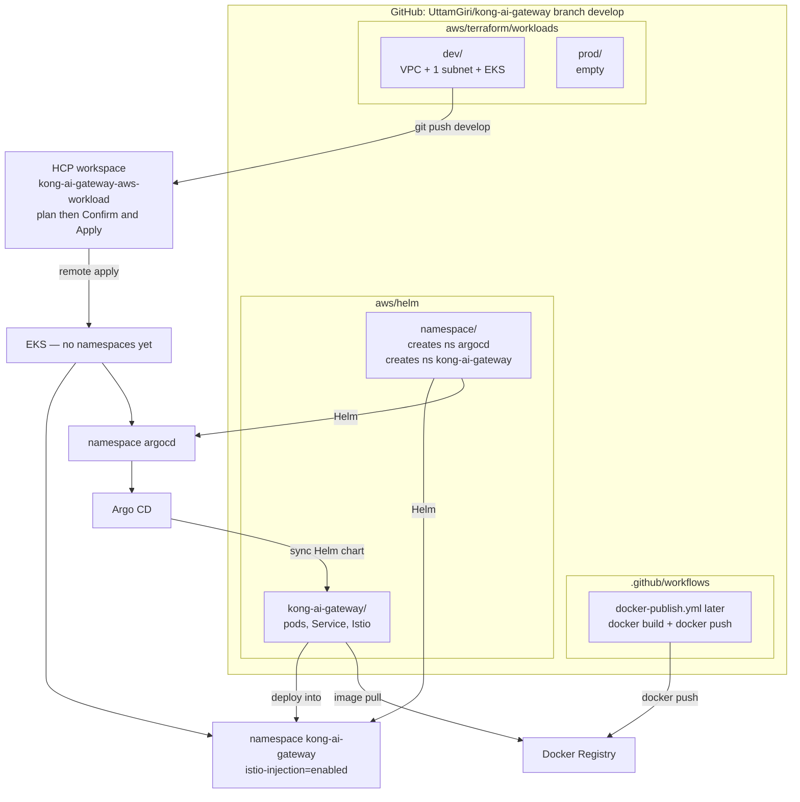
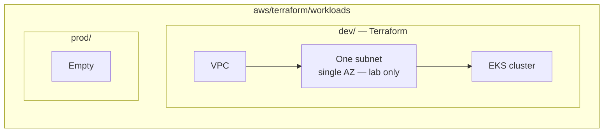
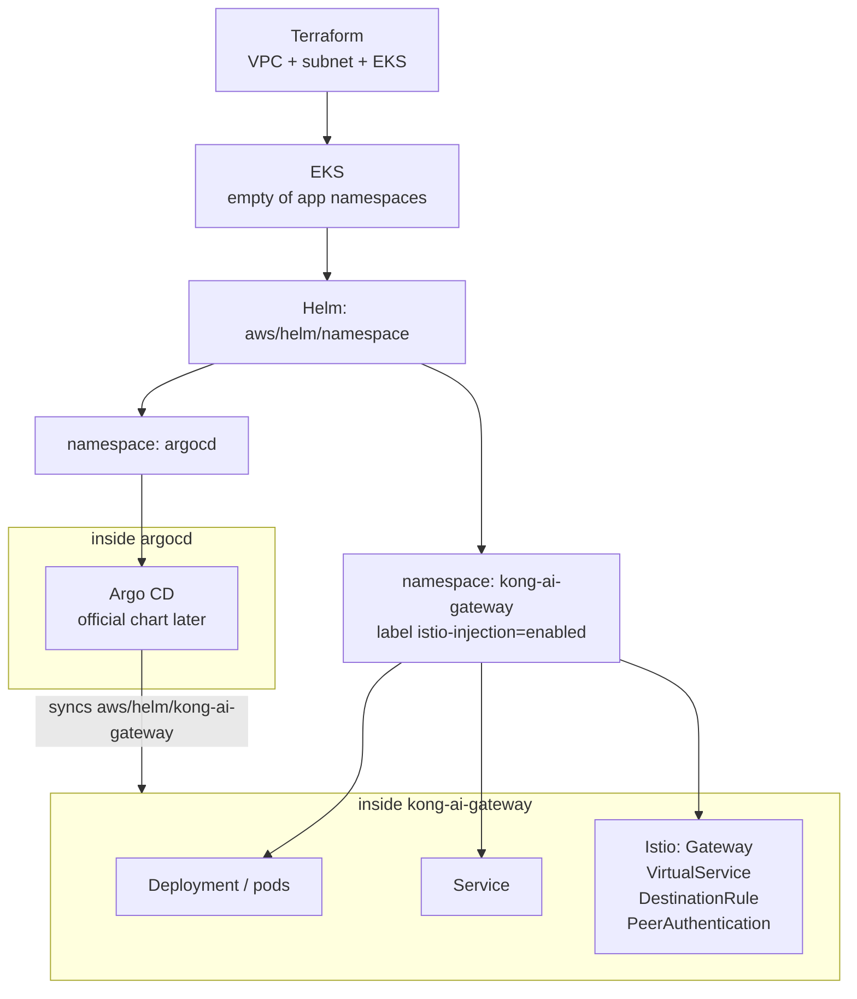
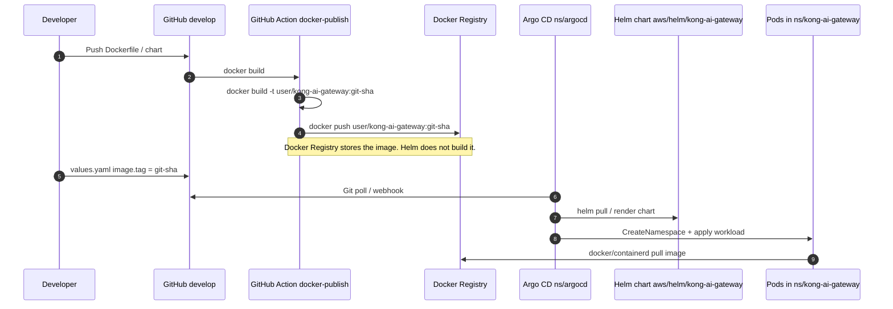
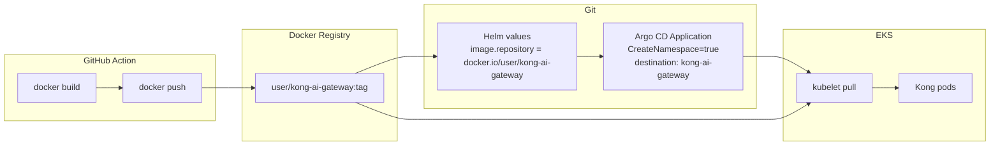
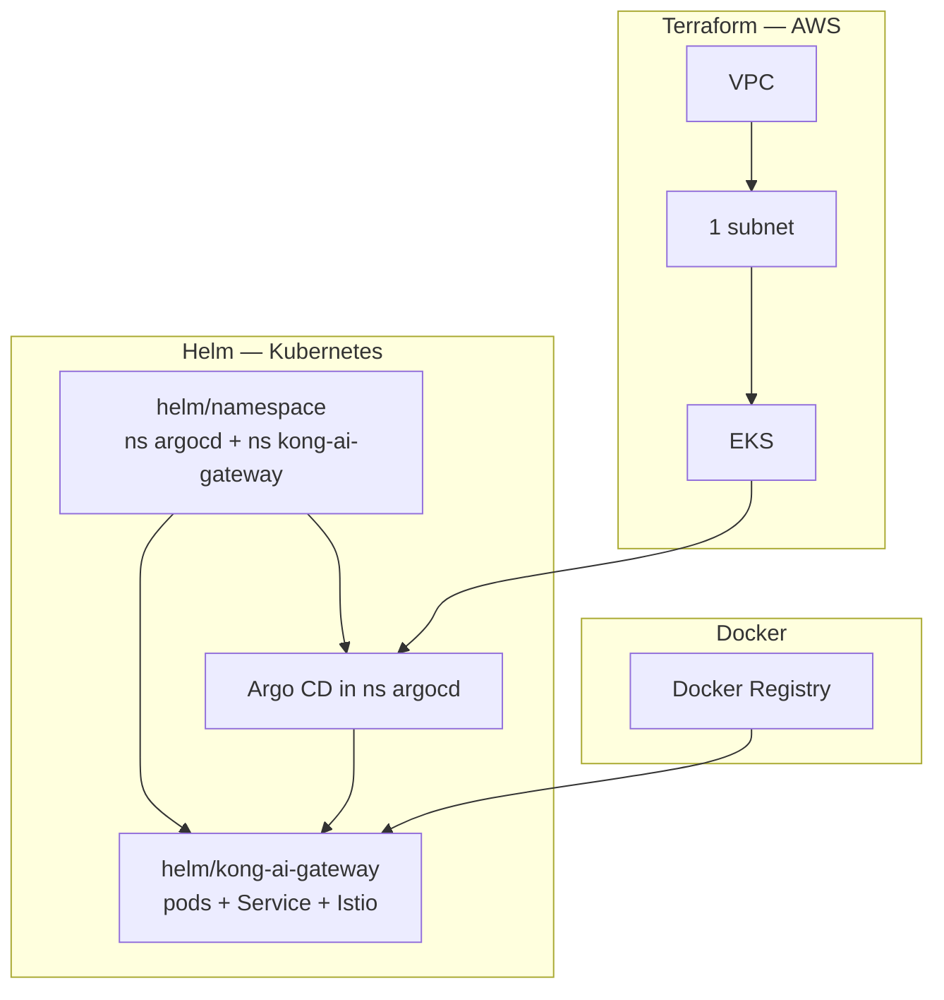
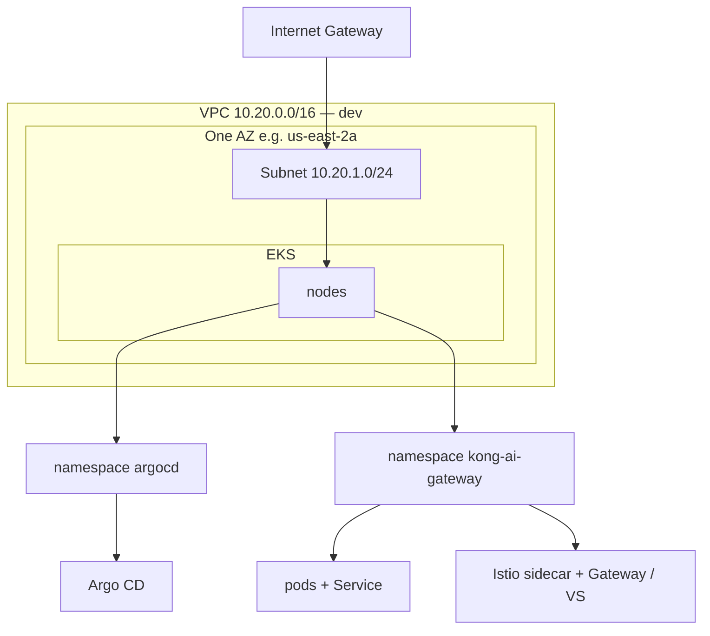
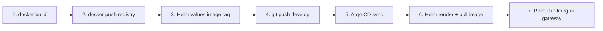

# AWS workloads architecture

Target layout for **kong-ai-gateway-aws-workload** (HCP Version control: plan on the workspace, Confirm & Apply). Image registry is a **Docker Registry** (Docker Hub or self-hosted `registry:2`), not ECR.

| Environment | Path | Contents |
| --- | --- | --- |
| **dev** | `dev/` | Terraform: VPC, one subnet, EKS only |
| **prod** | `prod/` | Empty on purpose |

Namespaces are **not** Terraform. They are a Helm chart (`aws/helm/namespace`) and they **do** appear on the cluster diagrams below.

---

## 1. Folder tree (repo)

```text
kong-ai-gateway/
├── .github/workflows/
│   └── docker-publish.yml
├── aws/
│   ├── helm/
│   │   ├── namespace/                 # TWO namespaces only
│   │   │   └── templates/
│   │   │       ├── argocd.yaml
│   │   │       └── kong-ai-gateway.yaml
│   │   └── kong-ai-gateway/           # app + mesh (not namespaces)
│   │       └── templates/
│   │           ├── deployment.yaml    # pods
│   │           ├── service.yaml
│   │           ├── serviceaccount.yaml
│   │           └── istio/
│   │               ├── gateway.yaml
│   │               ├── virtualservice.yaml
│   │               ├── destinationrule.yaml
│   │               └── peerauthentication.yaml
│   ├── argocd/
│   └── terraform/workloads/
│       ├── dev/                       # Terraform root: VPC + 1 subnet + EKS
│       │   ├── versions.tf
│       │   ├── providers.tf
│       │   └── variables.tf
│       └── prod/                      # empty
```



---

## 2. What Terraform creates in `dev/`



No registry, no namespaces, no Kong, no Argo CD in Terraform. Namespaces appear after the **namespace Helm chart** runs (next section).

---

## 3. Namespaces — Helm chart `aws/helm/namespace`

Namespaces **are** on the cluster. They are just not Terraform. Chart `aws/helm/namespace` creates both:



| Chart | Path | Creates |
| --- | --- | --- |
| **namespace** | `aws/helm/namespace` | `argocd` + `kong-ai-gateway` only |
| **kong-ai-gateway** | `aws/helm/kong-ai-gateway` | pods, Service, ServiceAccount, Istio mesh objects **in** `kong-ai-gateway` |

Do not put `kind: Namespace` inside the Kong chart. Keep namespaces in `helm/namespace` so mesh labels (`istio-injection`) are not tied to app rollouts.

**Order**

1. Terraform: VPC → subnet → EKS  
2. Helm `aws/helm/namespace`: both namespaces  
3. Helm Argo CD into `argocd`  
4. Argo CD syncs `aws/helm/kong-ai-gateway` into `kong-ai-gateway` (pods, services, Istio)

---

## 4. Docker Registry → Helm → Argo CD → Kong

Not ECR. **`docker build` / `docker push`** to a Docker Registry, then Helm `image.repository` points at that registry. Nodes **pull** the image when Argo CD syncs.

Examples of registry URL (pick one later):

- Docker Hub: `docker.io/<user>/kong-ai-gateway:<tag>`
- Self-hosted: `registry.example.com/kong-ai-gateway:<tag>` (Docker Registry `registry:2`)





Cluster nodes need pull access (public Hub repo, or `imagePullSecret` for a private Docker Registry). Terraform does not create that registry.

---

## 5. End-to-end: who owns what



| Layer | Tool | Creates |
| --- | --- | --- |
| IAM for HCP | Bootstrap Terraform | OIDC + role |
| Network + cluster | Workloads Terraform `dev/` | VPC, 1 subnet, EKS |
| Both namespaces | Helm `aws/helm/namespace` | `argocd`, `kong-ai-gateway` |
| Argo CD | Helm (official chart) into `argocd` | Argo CD |
| Kong image | `docker build` + `docker push` | Docker Registry |
| Kong + Istio | Helm `aws/helm/kong-ai-gateway` via Argo CD | Deployment, Service, Istio |
| Prod | Nothing | `prod/` empty |

---

## 6. Network sketch (dev, one subnet)



---

## 7. How a Kong change goes live



No Terraform in this path.

---

## 8. Daily cost

Full calculator (rates, formulas, worked example, add-ons): **[dev/DESTROY.md](dev/DESTROY.md#cost-calculator-us-east-2-on-demand-linux-list-price)**.

This Terraform only (**1 × t3.medium**, no NAT, no NLB): **~$3.57/day** (~$107/month). `enabled = false` + apply → **$0/day** for this stack.

### Destroy switch (`enabled`)

All demo resources are behind `module.demo` with `count = var.enabled ? 1 : 0`. Set **`enabled = false`** and **apply** to destroy the stack. Do not comment out code.

| `enabled` | Result |
| --- | --- |
| `true` | Create / keep VPC, EKS, nodes |
| `false` | Hard delete (EBS `delete_on_termination`, no KMS, no S3 retain) |

HCP: set `enabled = false`, Start new run, Confirm & Apply. Helm/Istio load balancers are not in state; destroy tries to delete tagged ELBs first so the VPC can go.

Larger nodes (`t3.large` × 2) add ~$2/day. Turning the cluster off nights/weekends is the main way to cut this (EKS control plane still bills if the cluster exists).

These are list prices, not a quote. Check [AWS Pricing](https://aws.amazon.com/eks/pricing/) and the billing console after apply.

---

## 9. HCP / GitHub

- Workspace **kong-ai-gateway-aws-workload**: **Version control**. Branch **`develop`**. Working directory **`aws/terraform/workloads/dev`**. Trigger prefix `aws/terraform/workloads`. Auto-apply off.
- Push matching files → plan appears on the HCP workspace → **Confirm & Apply**.
- Bootstrap: same VCS pattern on `aws/terraform/bootstrap`.
